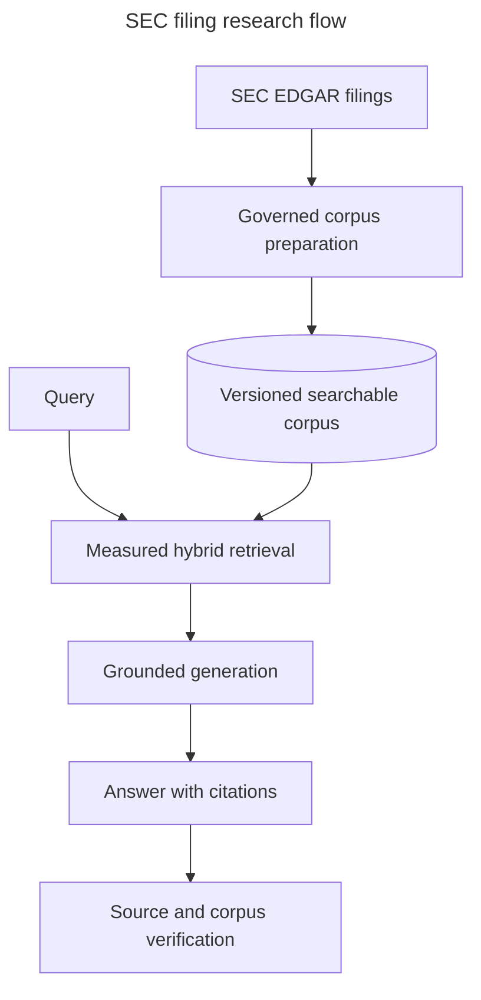

# SEC Filing RAG proof of concept

**Live demo:** [sec-filing-rag-poc.henrychan.dev](https://sec-filing-rag-poc.henrychan.dev)

[](https://sec-filing-rag-poc.henrychan.dev)

This repository is a capstone project for the
[DataTalksClub LLM Zoomcamp](https://github.com/DataTalksClub/llm-zoomcamp). It applies the
course's end-to-end RAG, retrieval evaluation, LLM evaluation, orchestration, and monitoring
practices to public SEC filings.

This project demonstrates how retrieval-augmented generation (RAG) can turn long SEC Form 10-K
filings into a governed, searchable knowledge source. Instead of asking a language model to rely on
its training memory, the application retrieves relevant filing passages, generates a grounded
answer, and preserves citations, source lineage, quality measurements, and cost records. The result
is a practical reference architecture for adopting RAG where answers must remain inspectable and
the underlying knowledge changes over time.

[Benefits](#why-this-system) · [Features](#features) · [Architecture](#architecture) ·
[Quick start](#quick-start) · [Complete journey](#complete-setup-evaluation-and-use) · [Usage](#usage) · [Documentation](#documentation) ·
[Development](#development-and-testing) · [Status](#license-and-project-status)

## Why this system

### Why RAG

RAG retrieves selected evidence from an application-managed corpus before a large language model
(LLM) writes an answer. This pattern creates several business advantages:

- **Knowledge changes without model retraining.** New filings can be ingested and activated without
  fine-tuning an LLM, shortening update cycles and separating company knowledge from model choice.
- **Answers are reviewable.** Citations connect generated claims to exact source passages, helping
  analysts verify important conclusions instead of accepting opaque output.
- **Quality is measurable.** Retrieval and generation can be evaluated independently, making weak
  components easier to diagnose and improve.
- **Cost is bounded and visible.** The model receives the question and a limited set of relevant
  passages rather than the full library. Token usage, attempts, latency, and request-time pricing
  snapshots make spending easier to understand and budget.
- **Data control remains with the application.** The corpus, versions, access rules, and lineage are
  stored outside the model. This implementation sends selected public filing passages to the
  configured OpenAI service; confidential deployments would also need appropriate model hosting,
  provider retention terms, and security controls.

### Why SEC EDGAR filings

Original Form 10-K filings are authoritative, public disclosures containing business descriptions,
material risks, legal proceedings, management analysis, market-risk disclosures, and financial
statements. Their stable accessions and source URLs support auditability, while their length makes
retrieval more practical than placing an entire filing in every prompt.

They are also a realistic document-engineering test. Filing HTML mixes narrative prose, headings,
cross-references, tables, page furniture, and inline XBRL markup—structured, semi-structured, and
unstructured information in one source. Common Item labels create useful consistency; differences
between issuers and years expose the parsing, normalization, chunking, and evaluation challenges a
production knowledge system must address.

### Why this implementation

| Characteristic | Business benefit |
| --- | --- |
| Benchmark-selected hybrid retrieval | Combines keyword precision and semantic matching using measured results rather than an assumed default. |
| Human-reviewed ground truth | Makes retrieval quality visible through Hit Rate, mean reciprocal rank, and latency. |
| Versioned corpora and pinned citations | Keeps historical research reproducible after a newer filing becomes active. |
| Exact provenance and corpus reader | Lets reviewers inspect the same source text and chunk boundaries used by the model. |
| Transactional activation and failure isolation | Preserves previously ready data when one company or ingestion attempt fails. |
| Policy and citation validation | Separates grounded filing research from unsupported requests and investment advice. |
| Persisted usage and pricing snapshots | Improves operational and cost visibility across provider calls and retries. |

---
#### Sample screenshots

##### Query
Investor research input on a specific goal and target:

The Corresponding research result:


##### Retrieval evaluation metrics


##### Corpus Reader


## Features

- **Corpus pipeline:** acquires original 10-K HTML through EdgarTools, extracts six Items, creates
  deterministic chunks and embeddings, validates lineage, and safely activates ready corpora.
- **Retrieval evaluation:** uses human-reviewed questions to compare keyword, vector, weighted
  hybrid, and reciprocal-rank-fusion strategies.
- **Grounded research:** retrieves filing evidence, produces structured cited answers, persists
  reproducibility and usage data, and supports idempotent synchronous or streamed requests.
- **Corpus reader:** browses complete Items, opens historical versions, highlights exact chunk
  ranges, and links passages back to EDGAR.
- **Operational controls:** isolates company failures, preserves prior defaults, records safe errors,
  and exposes health and batch status through FastAPI.
- **Authenticated access and budgets:** signs users in through Google, keeps research private to its
  owner and administrators, and reserves a configurable lifetime allowance before provider work.

## Implemented capabilities

| Capability | What is implemented | Further details |
| --- | --- | --- |
| Investor research problem | The product turns lengthy, changing Form 10-K disclosures into evidence-grounded research for self-directed investors. | [Why this system](#why-this-system) and [research design](docs/research.md) |
| End-to-end RAG flow | PostgreSQL, pgvector, and pg_textsearch retrieve versioned keyword and semantic evidence before OpenAI produces a validated, cited answer. | [Retrieval service](src/sec_filing_rag/retrieval/service.py) and [generation service](src/sec_filing_rag/generation/service.py) |
| Retrieval quality measurement | A human-reviewed 96-question benchmark compares keyword, vector, weighted-hybrid, and reciprocal-rank-fusion retrieval; the measured winner is promoted explicitly. | [Retrieval results](evaluation/results/retrieval-v1.md) and [selected configuration](config/retrieval.json) |
| Generated-answer quality measurement | Multiple answer prompts are tested over the same 96 cases with citation audits and an LLM judge; the accepted prompt is promoted explicitly. | [Generation results](evaluation/results/generation-v1.md) and [selected configuration](config/generation.json) |
| Web application and API | FastAPI and React provide authenticated research, history, evaluation, corpus reading, citation inspection, usage details, and feedback. | [API routers](src/sec_filing_rag/api/routers/public) and [frontend pages](frontend/src/pages) |
| Automated ingestion | Kestra coordinates repeat-safe scheduled and operator-requested SEC ingestion while FastAPI owns durable batch, filing, and corpus state. | [Kestra batch workflow](workflows/filing_batch.yaml) and [ingestion service](src/sec_filing_rag/services/ingestion.py) |
| Feedback and quality visibility | Users can submit persisted answer feedback, and public plus authenticated dashboards expose retrieval and generation quality. | [Feedback endpoint](src/sec_filing_rag/api/routers/public/feedback.py), [research repository](src/sec_filing_rag/repositories/research.py), and [evaluation UI](frontend/src/pages/EvaluationOverview.tsx) |
| Containerized runtime | The repository provides a production application image, containerized PostgreSQL and Kestra dependencies, a Dev Container, and K3s manifests. | [Application Dockerfile](Dockerfile), [development Compose stack](.devcontainer/docker-compose.yml), and [K3s base](deploy/k3s/base) |
| Reproducible setup | Dependencies are locked, migrations and safe environment templates are tracked, evaluation artifacts are checksum-validated, and validation commands are documented. | [Dependency lock](uv.lock), [getting started](docs/getting-started.md), and [testing guide](docs/testing.md) |
| Advanced retrieval | Weighted hybrid search and course-style reciprocal-rank-fusion re-ranking are both implemented and evaluated. | [Retrieval implementation](src/sec_filing_rag/retrieval/service.py) and [benchmark report](evaluation/results/retrieval-v1.md) |
| Working deployment | The application and its supporting services run on a single-node K3s deployment using immutable image identities and externally managed secrets. | [Live application](https://sec-filing-rag-poc.henrychan.dev) and [deployment manifests](deploy/k3s) |

The implementation's strongest advantages are exact citation provenance, immutable corpus versions,
benchmark-selected defaults, failure-isolated ingestion, provider-usage and cost records, and
reviewable security gates. These controls make results easier to inspect, reproduce, and update as
new filings become available. User feedback is persisted.

## Architecture



FastAPI owns policy and durable application state. Kestra sequences ingestion callbacks. PostgreSQL
stores source snapshots, corpus versions, search documents, research, and evaluation lineage.
EdgarTools acquires original filings, and OpenAI supplies embeddings and answer generation. See the
[architecture guide](docs/architecture.md) for component and trust boundaries.

## Prerequisites

- Git, Visual Studio Code with Dev Containers, and Docker Desktop or a compatible Docker runtime
- A truthful SEC identity
- OpenAI API credentials
- Local PostgreSQL and Kestra services supplied by the Dev Container
- Values from `.env.example` copied into an untracked `.env`
- A Google OAuth web client with the exact `/api/auth/google/callback` URI registered

The application fails fast when required settings, tracked configuration, pricing, database
connectivity, or migration checksums are invalid. It does not probe SEC, OpenAI, or Kestra
availability during startup.

See [Getting started](docs/getting-started.md) for account setup, exact configuration, evaluation,
promotion, and acceptance guidance.

## Quick start

Open the repository in its Dev Container, copy `.env.example` to `.env`, replace every placeholder,
and then run:

```bash
# Apply pending application-database migrations.
uv run sec-rag-migrate

# Start the FastAPI backend.
uv run sec-rag-api

# Start the React development server.
npm --prefix frontend run dev
```

Import `workflows/filing_batch.yaml` and `workflows/scheduled_filing_launcher.yaml` through the
Kestra UI at <http://127.0.0.1:18082>. The launcher checks enabled companies daily at 06:08 UTC and
reuses the shared batch flow. FastAPI is
available on port 8000 and the frontend on port 5173. Complete initial setup and ingestion are in
[Getting started](docs/getting-started.md); recurring developer commands are in
[local development](docs/local-development.md).

## Complete setup, evaluation, and use

The complete project journey is:

1. Install the prerequisites, clone the repository, and reopen it in the Dev Container.
2. Create `.env`, configure SEC/OpenAI/Google/Kestra/PostgreSQL values, and start the backend and
   frontend.
3. Import both Kestra filing workflows, sign in, and use **Prepare latest filings** to create the
   initial searchable corpora.
4. Use the checked-in promoted retrieval and generation defaults for a fast functional review, or
   continue with the full quality workflow.
5. Generate and human-review local ground truth, finalize it, and run retrieval evaluation.
6. Review and manually promote the accepted retrieval result.
7. Run full-RAG prompt evaluation against that fixed retrieval configuration, calibrate judge
   verdicts, and manually promote the accepted prompt.
8. Restart after configuration changes and verify research, evaluation evidence, corpus reading,
   history, citations, and operational usage.

The end-to-end commands, completion checks, fast/full path split, and fresh-database lineage caveat
are in [Getting started: set up, evaluate, and use the system](docs/getting-started.md).

## Usage

After Google sign-in, a fresh installation shows **Prepare latest filings** on the Query page.
Submit it once and wait for the UI to report ready corpora. The browser supplies the authenticated
session and CSRF protection required by the ingestion API.

Open <http://127.0.0.1:5173/> for the public journey, <http://127.0.0.1:5173/overview> for why RAG
helps, <http://127.0.0.1:5173/how-it-works> for the implementation, and
<http://127.0.0.1:5173/evaluation> for measured results. Aggregate retrieval and answer-quality
dashboards are public; question-level evaluation, Query, and the Library require
sign-in. API conventions and generated contracts are described in [API reference](docs/api.md).

## Documentation

Start with the [documentation index](docs/README.md), or go directly to:

- [Architecture](docs/architecture.md) — system structure, boundaries, and invariants
- [Getting started](docs/getting-started.md) — clone, configure, ingest, evaluate, promote, and use
- [Command reference](docs/commands.md) — project CLIs, frontend scripts, checks, and workflow links
- [Pipeline](docs/pipeline.md) — acquisition through validated corpus activation
- [Evaluation](docs/evaluation.md) — benchmark design and retrieval selection
- [Evaluation prompt roles](docs/rag-evaluation-workflow.md#prompt-roles-in-full-rag-evaluation) — candidate answer generation and judging
- [Research](docs/research.md) — grounded answer lifecycle and guardrails
- [Corpus reader](docs/corpus-reader.md) — contextual reading and source navigation
- [Operations](docs/operations.md) — runtime readiness, observability, migrations, and recovery
- [Glossary](docs/glossary.md) — RAG and project terminology

## Development and testing

The following sequence scans Git history for secrets; checks Python formatting, lint, and types;
runs backend and frontend tests; builds the production UI; and confirms that generated API
contracts match the application.

```bash
# Scan complete Git history using the tracked rules without printing secret values.
gitleaks git --config .gitleaks.toml --redact .

# Verify Python formatting without modifying files.
uv run ruff format --check .

# Run Python lint rules.
uv run ruff check .

# Check strict Python types.
uv run mypy

# Run the backend suite with a disposable EdgarTools cache location.
EDGAR_LOCAL_DATA_DIR=/tmp/edgar-cache uv run pytest

# Run frontend formatting, lint, unit tests, type-checking, and production build.
npm --prefix frontend run check

# Confirm checked-in OpenAPI and REST Client artifacts are current.
uv run sec-rag-export-openapi --check
uv run sec-rag-generate-http --check
```

See [local development](docs/local-development.md) for daily workflows and [testing](docs/testing.md)
for test layers, live-test boundaries, and acceptance criteria.

## License and project status

This is a focused proof of concept, not an investment-advice or production research service. It
deliberately covers configured companies and six original 10-K Items, renders complex tables as
indexed plain text, and uses local infrastructure plus external SEC/OpenAI services. These choices
keep the demonstration centered on measurable retrieval, grounding, lineage, and failure safety.

Licensed under the [PolyForm Noncommercial License 1.0.0](LICENSE).
