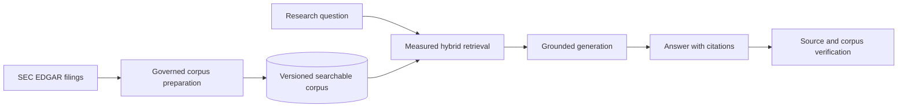

# SEC Filing RAG proof of concept

This project demonstrates how retrieval-augmented generation (RAG) can turn long SEC Form 10-K
filings into a governed, searchable knowledge source. Instead of asking a language model to rely on
its training memory, the application retrieves relevant filing passages, generates a grounded
answer, and preserves citations, source lineage, quality measurements, and cost records. The result
is a practical reference architecture for adopting RAG where answers must remain inspectable and
the underlying knowledge changes over time.

[Benefits](#why-this-system) · [Features](#features) · [Architecture](#architecture) ·
[Quick start](#quick-start) · [Usage](#usage) · [Documentation](#documentation) ·
[Development](#development-and-testing) · [Status](#license-and-project-status)

## Why this system

### Why RAG

RAG retrieves selected evidence from an application-managed corpus before a large language model
(LLM) writes an answer. This pattern creates several business advantages:

- **Knowledge changes without model retraining.** New filings can be ingested and activated without
  fine-tuning an LLM, shortening update cycles and separating company knowledge from model choice.
- **Answers are reviewable.** Citations connect generated claims to exact source passages, helping
  analysts verify important conclusions instead of accepting opaque output.
- **Quality is measurable.** Retrieval and generation can be evaluated independently, making weak
  components easier to diagnose and improve.
- **Cost is bounded and visible.** The model receives the question and a limited set of relevant
  passages rather than the full library. Token usage, attempts, latency, and request-time pricing
  snapshots make spending easier to understand and budget.
- **Data control remains with the application.** The corpus, versions, access rules, and lineage are
  stored outside the model. This implementation sends selected public filing passages to the
  configured OpenAI service; confidential deployments would also need appropriate model hosting,
  provider retention terms, and security controls.

### Why SEC EDGAR filings

Original Form 10-K filings are authoritative, public disclosures containing business descriptions,
material risks, legal proceedings, management analysis, market-risk disclosures, and financial
statements. Their stable accessions and source URLs support auditability, while their length makes
retrieval more practical than placing an entire filing in every prompt.

They are also a realistic document-engineering test. Filing HTML mixes narrative prose, headings,
cross-references, tables, page furniture, and inline XBRL markup—structured, semi-structured, and
unstructured information in one source. Common Item labels create useful consistency; differences
between issuers and years expose the parsing, normalization, chunking, and evaluation challenges a
production knowledge system must address.

### Why this implementation

| Characteristic | Business benefit |
| --- | --- |
| Benchmark-selected hybrid retrieval | Combines keyword precision and semantic matching using measured results rather than an assumed default. |
| Human-reviewed ground truth | Makes retrieval quality visible through Hit Rate, mean reciprocal rank, and latency. |
| Versioned corpora and pinned citations | Keeps historical research reproducible after a newer filing becomes active. |
| Exact provenance and corpus reader | Lets reviewers inspect the same source text and chunk boundaries used by the model. |
| Transactional activation and failure isolation | Preserves previously ready data when one company or ingestion attempt fails. |
| Policy and citation validation | Separates grounded filing research from unsupported requests and investment advice. |
| Persisted usage and pricing snapshots | Improves operational and cost visibility across provider calls and retries. |

---
#### Sample screenshots

##### Investor Research
Investor research input on a specific goal and target:

The Corresponding research result:


##### Retrieval evaluation metrics


##### Corpus Reader


## Features

- **Corpus pipeline:** acquires original 10-K HTML through EdgarTools, extracts six Items, creates
  deterministic chunks and embeddings, validates lineage, and safely activates ready corpora.
- **Retrieval evaluation:** uses human-reviewed questions to compare keyword, vector, weighted
  hybrid, and reciprocal-rank-fusion strategies.
- **Grounded research:** retrieves filing evidence, produces structured cited answers, persists
  reproducibility and usage data, and supports idempotent synchronous or streamed requests.
- **Corpus reader:** browses complete Items, opens historical versions, highlights exact chunk
  ranges, and links passages back to EDGAR.
- **Operational controls:** isolates company failures, preserves prior defaults, records safe errors,
  and exposes health and batch status through FastAPI.
- **Authenticated access and budgets:** signs users in through Google, keeps research private to its
  owner and administrators, and reserves a configurable lifetime allowance before provider work.

## Architecture



FastAPI owns policy and durable application state. Kestra sequences ingestion callbacks. PostgreSQL
stores source snapshots, corpus versions, search documents, research, and evaluation lineage.
EdgarTools acquires original filings, and OpenAI supplies embeddings and answer generation. See the
[architecture guide](docs/architecture.md) for component and trust boundaries.

## Prerequisites

- A Dev Container-compatible Docker environment
- A truthful SEC identity
- OpenAI API credentials
- Local PostgreSQL and Kestra services supplied by the Dev Container
- Values from `.env.example` copied into an untracked `.env`
- A Google OAuth web client with the exact `/api/auth/google/callback` URI registered

The application fails fast when required settings, tracked configuration, pricing, database
connectivity, or migration checksums are invalid. It does not probe SEC, OpenAI, or Kestra
availability during startup.

## Quick start

Open the repository in its Dev Container, copy `.env.example` to `.env`, replace every placeholder,
and then run:

```bash
# Apply pending application-database migrations.
uv run sec-rag-migrate

# Start the FastAPI backend.
uv run sec-rag-api

# Start the React development server.
npm --prefix frontend run dev
```

Import `workflows/filing_batch.yaml` through the Kestra UI at <http://127.0.0.1:18082>. FastAPI is
available on port 8000 and the frontend on port 5173. Detailed setup and port information lives in
[local development](docs/local-development.md).

## Usage

Prepare the latest original 10-K for all enabled companies:

```bash
# Create a latest-filing preparation batch for every enabled company.
curl --fail-with-body -i -X POST http://127.0.0.1:8000/api/filing-batches \
  -H 'Content-Type: application/json' -d '{}'
```

Poll the returned batch and inspect company readiness:

```bash
# Read durable progress for the submitted batch.
curl --fail-with-body -i http://127.0.0.1:8000/api/filing-batches/$BATCH_ID

# Confirm the company's active and historical corpus readiness.
curl --fail-with-body -i http://127.0.0.1:8000/api/companies/AAPL/status
```

Open <http://127.0.0.1:5173/research> for grounded research,
<http://127.0.0.1:5173/evaluation> for retrieval evaluation, or
<http://127.0.0.1:5173/corpus> to browse indexed filings. API conventions and generated contracts
are described in [API reference](docs/api.md).

## Documentation

Start with the [documentation index](docs/README.md), or go directly to:

- [Architecture](docs/architecture.md) — system structure, boundaries, and invariants
- [Pipeline](docs/pipeline.md) — acquisition through validated corpus activation
- [Evaluation](docs/evaluation.md) — benchmark design and retrieval selection
- [Research](docs/research.md) — grounded answer lifecycle and guardrails
- [Corpus reader](docs/corpus-reader.md) — contextual reading and source navigation
- [Operations](docs/operations.md) — runtime, migrations, recovery, and promotion
- [Glossary](docs/glossary.md) — RAG and project terminology

## Development and testing

The following sequence checks Python formatting, lint, and types; runs backend and frontend tests;
builds the production UI; and confirms that generated API contracts match the application.

```bash
# Verify Python formatting without modifying files.
uv run ruff format --check .

# Run Python lint rules.
uv run ruff check .

# Check strict Python types.
uv run mypy

# Run the backend suite with a disposable EdgarTools cache location.
EDGAR_LOCAL_DATA_DIR=/tmp/edgar-cache uv run pytest

# Run frontend formatting, lint, unit tests, type-checking, and production build.
npm --prefix frontend run check

# Confirm checked-in OpenAPI and REST Client artifacts are current.
uv run sec-rag-export-openapi --check
uv run sec-rag-generate-http --check
```

See [local development](docs/local-development.md) for daily workflows and [testing](docs/testing.md)
for test layers, live-test boundaries, and acceptance criteria.

## License and project status

This is a focused proof of concept, not an investment-advice or production research service. It
deliberately covers configured companies and six original 10-K Items, renders complex tables as
indexed plain text, and uses local infrastructure plus external SEC/OpenAI services. These choices
keep the demonstration centered on measurable retrieval, grounding, lineage, and failure safety.

Licensed under the [PolyForm Noncommercial License 1.0.0](LICENSE).
