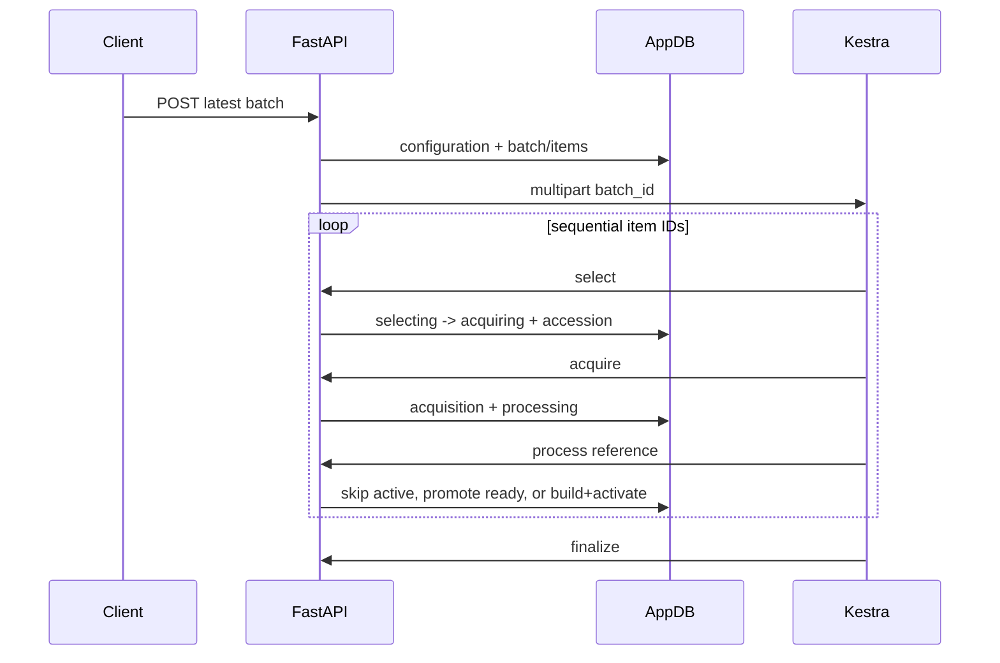
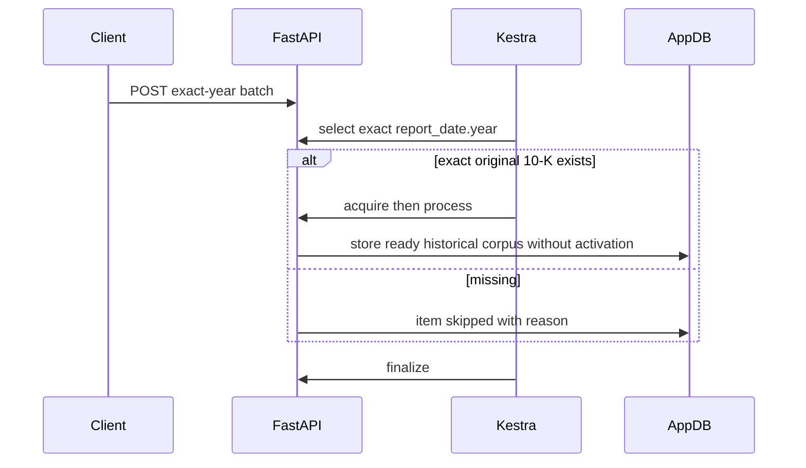

# API and orchestration design

This is the contract layer between [architecture](architecture.md) and the [corpus pipeline](corpus-pipeline.md). Public routes accept intent and expose application-owned state. Every internal route requires `Authorization: Bearer <INGESTION_API_TOKEN>` and exchanges references only.

The answer schema requires `answered`, `investment_advice`, or `out_of_scope`. Advice includes trades,
recommendations, valuation/targets, forecasts, sizing, hedging, and timing. Out-of-scope includes other
companies, unsupported forms, news/market sources, XBRL/accounting calculations, technical analysis,
and legal or tax advice. A supported selected-company 10-K question stays in scope despite imperfect
goal-label alignment. Classification shares the generation call so empty retrieval can still separate
rejection from insufficient evidence. Rejections are persisted for lineage and usage, while generated
rejection text is discarded and public evidence is suppressed.

## Endpoint catalog

| Method and path | Effect |
|---|---|
| `GET /api/health` | Verify application schema readiness. |
| `GET /api/companies` | List configured companies and readiness summary. |
| `GET /api/companies/{ticker}/status` | Return active corpus, non-default historical corpora, coverage, and latest run. |
| `POST /api/filing-batches` | Persist all enabled or an ordered subset; optional `fiscal_year` selects exact-year mode; submit Kestra. |
| `POST /api/companies/{ticker}/filing-preparations` | Convenience one-item batch; retained path, batch persistence. |
| `GET /api/filing-batches/{batch_id}` | Return authoritative aggregate and ordered item states. |
| `GET /internal/filing-batches/{batch_id}` | Load item IDs for Kestra iteration. |
| `POST /internal/providers/filing-items/{item_id}/selection` | Select latest/exact-year accession or skip a missing exact year. |
| `POST /internal/providers/filing-items/{item_id}/acquisitions` | Acquire, validate, persist HTML, return safe reference metadata. |
| `POST /internal/corpus-executions/{item_id}` | Reload acquisition; reuse/promote or build corpus. |
| `POST /internal/filing-items/{item_id}/failures` | Safely terminate one orchestration failure. |
| `POST /internal/filing-batches/{batch_id}/finalizations` | Fail stranded items and calculate aggregate state. |

Internal POST bodies contain only optional `kestra_execution_id`; failure additionally contains a generic error. Acquisition output contains UUID, accession, checksum, and size, never bytes/provider payload.

## Latest and exact-year sequences

## Kestra graph and verified fields

Kestra 1.3 schemas were verified for `io.kestra.plugin.core.http.Request`, `io.kestra.plugin.core.flow.ForEach`, and `io.kestra.plugin.core.flow.If`. `load_items` performs a protected GET. `execute_items` is a `ForEach` with `concurrencyLimit: 1`; each value calls `select`, conditionally `acquire` then `process`. Its local `errors` callback calls item failure with `allowFailure: true` and constant retry (`interval: PT5S`, `maxAttempts: 3`). The single flow `finally` calls finalization with the same retry and `allowFailure`. HTTP calls use `options.connectTimeout/readTimeout`; JSON bodies use `contentType` and `toJson`. There is no duplicate flow-level error finalizer.

## States, updates, and failures

Items normally move `pending → selecting → acquiring → processing → succeeded`. Selection can end `skipped`; callbacks can end `failed`. Each transition updates references/error/timestamps and execution correlation; the first transition moves the batch to `running`.

Batches move `submitted → running → succeeded|partial_failure|failed`. Submission failure marks pending items failed. Finalization converts incomplete items to failed. All succeeded means `succeeded`; at least one success plus any non-success means `partial_failure`; zero successes means `failed` (including all-skipped).

Selection/acquisition and persistence are retry-safe. Terminal selection and stored acquisition are reused. Corpus identity is filing plus compatibility key. Latest reuse promotes only when needed; exact-year reuse never promotes. Candidate validation and activation are transactional, so failure preserves previous data.

Public routes do not require internal bearer authentication. Internal routes use constant-time comparison and return 401 for missing/invalid tokens. Kestra submission uses Basic auth and multipart `batch_id`; credentials are redacted from errors. Request IDs and Kestra execution IDs provide correlation. Provider/network/model details become bounded safe errors.
