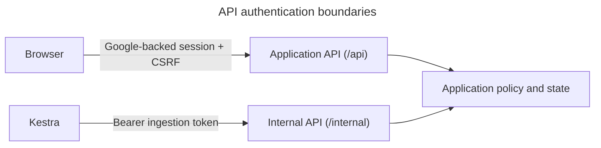
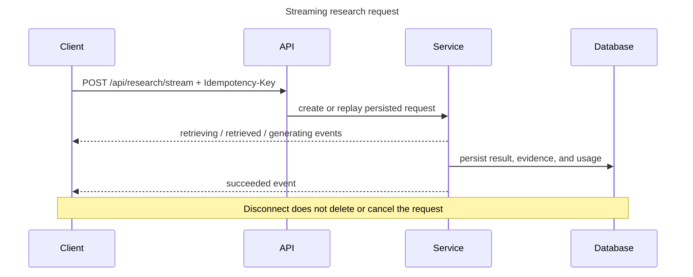

# API

FastAPI exposes a public `/api` boundary for business intent and a protected `/internal` boundary
for reference-only orchestration callbacks. The generated [OpenAPI contract](../api/openapi.yaml) is
the field-level source of truth; this guide explains conventions, endpoint groups, and behavior that
is easier to understand across operations.

## Boundary and authentication



Authentication callbacks, health, the editorial showcase, evaluation overviews, and aggregate
evaluation summaries are anonymous. Research, filing access, question-level evaluation artifacts,
and other application routes require a revocable server-side session; unsafe requests also require
the session CSRF value. Cross-user resource identifiers return `404`. Internal routes use
constant-time bearer-token comparison and return `401` when credentials are missing or invalid.
Kestra submission is different:
FastAPI authenticates to Kestra with Basic authentication and sends only a batch identifier.

Never place source HTML, `.env` values, provider credentials, authorization headers, or private data
in route parameters, workflow payloads, logs, or error messages.

## Public endpoint groups

| Group | Principal routes | Responsibility |
| --- | --- | --- |
| Authentication | Google login/callback, current account, logout | OIDC and local session lifecycle |
| Health | `GET /api/health` | Anonymous application/database readiness |
| Showcase | `GET /api/showcase` | Optional anonymous landing-page examples from deployment configuration |
| Companies | `GET /api/companies`, `GET /api/companies/{ticker}/status` | Configured discovery, active/historical corpus status |
| Filing batches | `POST /api/filing-batches`, one-company preparation, batch GET | Persist ingestion intent and expose durable progress |
| Research | synchronous/streaming POST, history GET, result GET | Grounded answer lifecycle and replay |
| Feedback | `POST /api/feedback` | One upsertable rating per research result |
| Evaluation | anonymous current summaries; protected cases, questions, prompts, and chunks | Aggregate benchmark presentation with signed-in evidence inspection |
| Corpus | version, Item, and chunk-location GETs | Read-only source context and canonical citation locations |
| Administration | users, account activity, account mutation | Admin-only consumption review, disabling, and budget overrides |

Research history/results, feedback, and filing-batch status are owner-scoped. Administrators use
the administration endpoints to inspect all users rather than broadening ordinary history queries.

The [Pipeline](pipeline.md), [Research](research.md), [Evaluation](evaluation.md), and
[Corpus reader](corpus-reader.md) guides explain feature semantics. This document does not duplicate
their response schemas.

## Internal endpoint groups

| Route | Purpose |
| --- | --- |
| `GET /internal/filing-batches/{batch_id}` | Return persisted item UUIDs for iteration |
| `POST /internal/scheduled-filing-batches` | Idempotently persist a first-admin-owned batch for the Kestra launcher |
| `POST /internal/providers/filing-items/{item_id}/selection` | Select exact/latest accession or record a skip |
| `POST /internal/providers/filing-items/{item_id}/acquisitions` | Acquire, validate, and persist source HTML |
| `POST /internal/corpus-executions/{item_id}` | Reuse, promote, or build a corpus from persisted acquisition |
| `POST /internal/filing-items/{item_id}/failures` | Safely terminate one orchestration failure |
| `POST /internal/filing-batches/{batch_id}/finalizations` | Close stranded items and calculate aggregate state |
| `POST /internal/filing-batches/{batch_id}/launch-failures` | Fail and reconcile a batch whose processing subflow never started |

Internal POST bodies contain only the optional Kestra execution identifier; failure callbacks add a
generic bounded error. Acquisition responses return reference metadata such as UUID, accession,
checksum, and size—not bytes or provider objects. Workflow sequencing belongs to
[Orchestration](orchestration.md).

The scheduled creation request also requires `X-Kestra-Execution-ID`. Repeating that ID returns the
same durable batch, so a lost HTTP response does not duplicate work or reserve cost twice. The
endpoint never submits Kestra itself; the launcher passes its returned `batch_id` to the shared
subflow.

## Validation and errors

FastAPI and Pydantic perform shape validation. Malformed UUIDs, unsupported Items, invalid tickers,
out-of-range values, and forbidden extra fields normally return `422`. Valid identifiers that do not
name an accessible resource return `404`. Conflict states such as changed-input idempotency replay or
invalid evaluation artifacts return `409`. Provider or processing failures are translated into
bounded application messages; raw third-party payloads do not cross the API.

`X-Request-ID` may be supplied with a safe value for correlation. The response returns the accepted
or generated identifier, and structured logs carry the same value.

## Idempotency and asynchronous work

Filing-batch submission accepts durable intent and returns `202`; polling reads application state,
not Kestra's database. Research accepts an optional UUID `Idempotency-Key`:

- A terminal same-input replay returns the stored result.
- A replay with changed input conflicts.
- A request already running returns its persisted research identifier for recovery.

The synchronous research endpoint returns the complete persisted response. The streaming endpoint
uses server-sent events (SSE)—a one-way HTTP event stream—to report observed stages while the same
service runs in a producer thread. Disconnecting does not cancel durable work; clients recover by
idempotency key or research identifier.



History uses an opaque URL-safe cursor representing the last `(created_at, UUID)` pair. Clients must
not construct or interpret it. Evaluation dashboard filters are browser query parameters, not API
pagination contracts.

## Generated contracts

Regenerate and verify the checked-in contracts with:

```bash
# Rewrite the OpenAPI document from FastAPI's registered routes and schemas.
uv run sec-rag-export-openapi

# Rewrite the REST Client collection from the OpenAPI document.
uv run sec-rag-generate-http

# Fail when either checked-in artifact differs from generated output.
uv run sec-rag-export-openapi --check
uv run sec-rag-generate-http --check
```

`api/openapi.yaml` supports schema review and client generation. `api/sec-filing-rag.http` provides
REST Client requests with environment-based host and internal-token variables. Generated artifacts
must change in the same commit as a public contract change.
