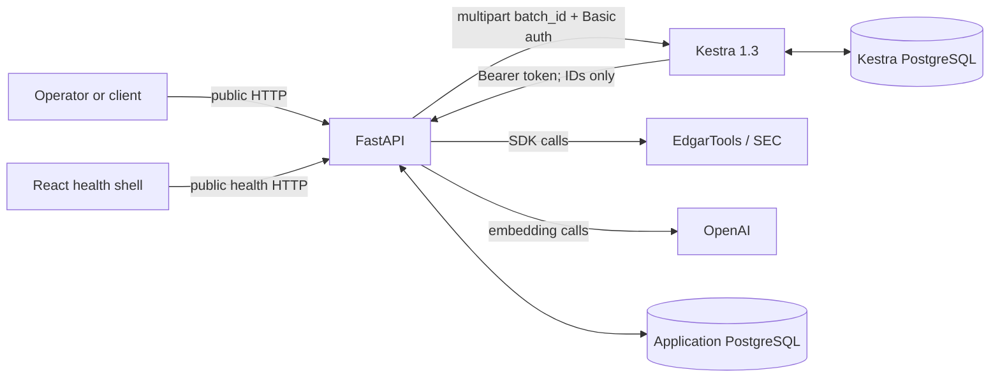

# Architecture

The public `/api` boundary accepts business intent. The protected `/internal` boundary accepts only persisted UUID references and an execution ID; it never accepts filing bytes, provider objects, or credentials. EdgarTools and OpenAI are external trust boundaries. Secrets stay in process configuration and Kestra secret resolution. Application and Kestra databases are isolated and have no cross-database constraints.

FastAPI is the policy and system-of-record layer: it validates configured companies, creates batches, selects exact/latest filings, validates and stores acquisitions, builds corpora, activates defaults, aggregates status, retrieves documents, and records evaluation lineage. Kestra provides sequential iteration, task retries, local item failure handling, execution history, and unconditional batch finalization. EdgarTools alone resolves tickers and obtains original 10-K metadata/HTML. OpenAI supplies embeddings and ground-truth-assessment calls. The frontend only checks API/database health.

## Bronze, silver, gold

EdgarTools metadata and exact UTF-8 HTML bytes enter immutable bronze snapshots; the batch acquisition record is the handoff between network acquisition and processing. Sanitized filing identity, corpus versions, six Item coverage records, and deterministic chunks form silver. Gold search documents repeat retrieval text plus embedding, lexical document, citation, and provenance. A validated ready corpus may receive the company's single default activation.

## Repository map

- `src/sec_filing_rag/api`: public and bearer-protected FastAPI routers/dependencies.
- `core`: settings, errors, resources, and request correlation.
- `domain`: sanitization, six-Item extraction, chunking, checksums, safe errors.
- `integrations`: EdgarTools and Kestra clients.
- `repositories`: PostgreSQL persistence for companies, workflows, corpora, retrieval, and evaluation.
- `services`: persisted batch execution and corpus processing.
- `retrieval`, `ground_truth`, `evaluation`, `cli`: search, dataset generation/review, benchmarking, migrations, and artifact generation.
- `workflows/filing_batch.yaml`: the only ingestion flow.
- `migrations/versions/0001_schema.sql`: the complete disposable application schema.

## Capabilities and invariants

The implementation supports configured ordered batches; latest and exact report-year selection; missing-year skips; retained historical corpora; compatible-corpus reuse and latest promotion; six required Items (1, 1A, 3, 7, 7A, 8); bounded sanitization; deterministic checksum-bound chunk IDs; embedding usage capture; transactional candidate validation; active-corpus retrieval; and reviewed evaluation.

Invariants: Python owns all business decisions; Kestra receives references only; original `10-K` excludes amendments; fiscal year means `report_date.year`; acquisition precedes corpus work; one filing/compatibility pair identifies a corpus; incomplete extraction cannot activate; exact-year mode cannot move the default; one company has at most one default; failures preserve the previous ready/default corpus; status never requires querying Kestra.
