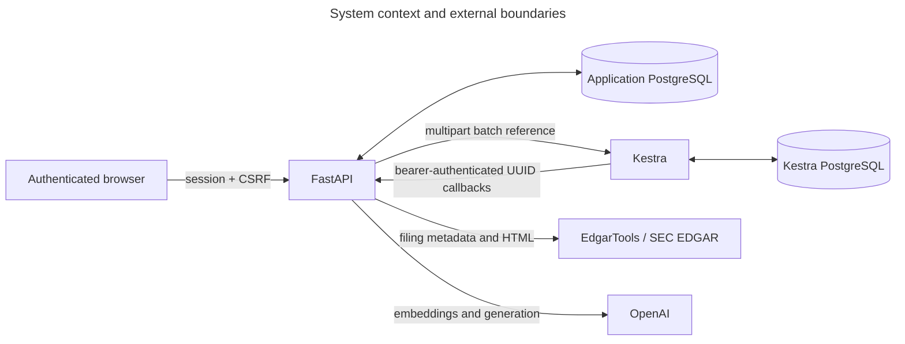
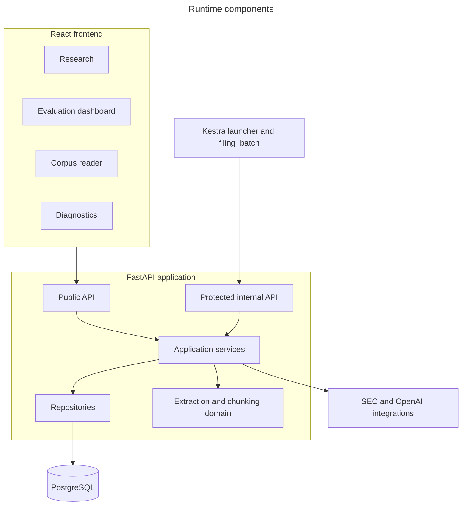
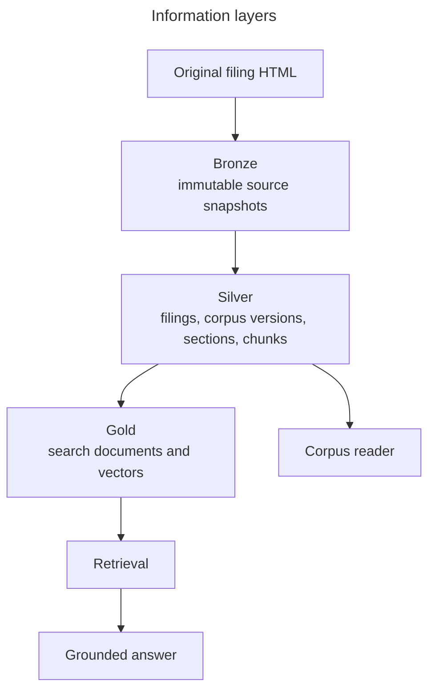
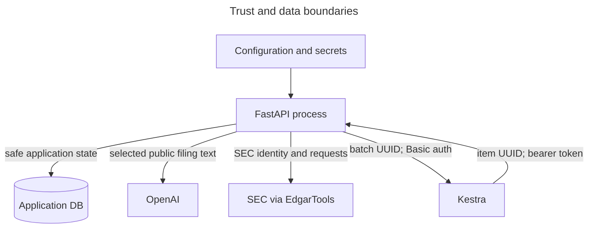

# Architecture

## System context

The application is a local reference architecture for retrieval-augmented generation (RAG) over
original SEC Form 10-K filings. FastAPI owns business policy and durable state; Kestra coordinates
long-running ingestion; PostgreSQL stores source, corpus, search, research, and evaluation lineage.
EdgarTools and OpenAI are external trust boundaries.

The application and Kestra databases are isolated. There are no cross-database foreign keys.
Credentials remain in process configuration or Kestra secret resolution and never travel in
reference-only workflow payloads.

## Runtime components

- **Public API:** accepts business intent and exposes application-owned state. See [API](api.md).
- **Identity and quota policy:** validates Google-backed sessions, enforces resource ownership, and
  reserves lifetime allowance before research or ingestion submission.
- **Internal API:** accepts persisted identifiers from Kestra and requires the ingestion bearer
  token. It never accepts filing bytes, provider objects, or credentials.
- **Services:** apply selection, lifecycle, research, and failure policies.
- **Repositories:** express PostgreSQL reads, transactions, constraints, and lineage hydration.
- **Domain code:** sanitizes filings and deterministically derives sections and chunks.
- **Integrations:** contain the EdgarTools, Kestra, and OpenAI boundaries.

## Information layers

Bronze preserves provider metadata and exact UTF-8 HTML bytes. Silver represents normalized filing
identity, versioned corpora, six Item coverage records, and deterministic chunks. Gold repeats the
retrieval fields needed for lexical and vector search. Gold is replaceable; silver remains the
authority for source text and offsets. Durable table ownership is documented in
[Database schema](database-schema.md).

## End-to-end data flow

1. A client submits latest or exact-report-year filing intent.
2. Kestra iterates persisted company work and calls protected application endpoints.
3. EdgarTools resolves and acquires original 10-K HTML; the application validates and stores it.
4. The pipeline sanitizes the document, extracts six Items, chunks present text, and creates
   embeddings.
5. A transaction writes lineage and search records, validates completeness, and optionally moves
   the active corpus pointer.
6. Research retrieves from one pinned corpus, sends selected evidence to generation, validates
   citations and policy, and persists the result.
7. The corpus reader resolves citations from silver data and displays the indexed text in context.

The feature-level mechanics belong to [Pipeline](pipeline.md), [Evaluation](evaluation.md),
[Research](research.md), and [Corpus reader](corpus-reader.md).

## Trust and data boundaries

- SEC filings are public, but credentials and `.env` values are sensitive.
- OpenAI receives chunk text for embeddings and selected evidence for answer/judge calls. The
  application does not claim an entirely private inference boundary.
- Kestra receives identifiers and safe errors, not source documents or provider payloads.
- Public errors are bounded. Logs exclude supplied credentials, authorization headers, and filing
  bodies.

## Cross-cutting invariants

- Python owns business decisions; Kestra coordinates retryable calls.
- Only original `10-K` forms are eligible; amendments are excluded.
- Fiscal year means `report_date.year`, and an exact-year miss never substitutes a neighboring year.
- Every corpus contains one coverage record for Items 1, 1A, 3, 7, 7A, and 8.
- A corpus cannot become ready or active when required validation fails.
- One company has at most one active/default corpus.
- Exact-year processing creates historical data and never changes the default.
- Failed candidate work preserves the previous ready/default corpus.
- Retrieval, research, and citation links pin a corpus version for reproducibility.
- Source offsets are resolved from silver, not the gold search projection.
- Status reads do not require querying Kestra.

These choices are explained in [Architecture decisions](decisions/README.md).

## Repository map

- `src/sec_filing_rag/api`: public and protected FastAPI routers and dependencies
- `core`: settings, startup validation, resources, observability, and pricing
- `domain`: filing sanitization, Item extraction, chunks, checksums, and safe errors
- `integrations`: EdgarTools and Kestra gateways
- `repositories`: application persistence and read models
- `services`: filing-batch and ingestion policy
- `retrieval`, `generation`, `ground_truth`, `evaluation`: the RAG lifecycle
- `frontend`: React research, evaluation, corpus, and diagnostic surfaces
- `workflows`: the single Kestra ingestion flow
- `migrations/versions`: immutable incremental application schema

## Focused POC boundaries

The system favors inspectability over broad document coverage. It supports configured companies,
original 10-K filings, and six Items; complex tables remain indexed plain text. Local infrastructure
keeps the deployment understandable, while external SEC and OpenAI services make source acquisition
and model behavior realistic. These boundaries concentrate the demonstration on RAG quality,
lineage, reproducibility, and failure safety rather than product breadth.
