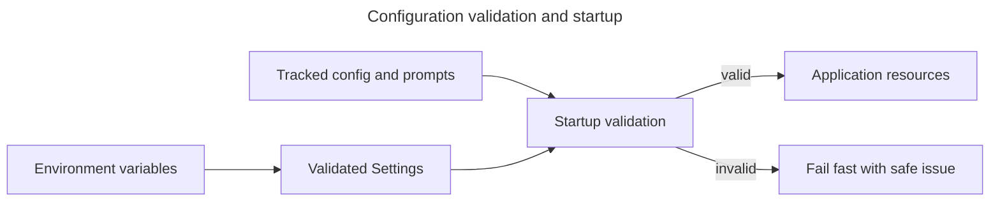

# Configuration

Configuration is divided between environment variables, which describe a deployment and contain
secrets, and tracked files, which define reproducible application behavior. Startup validates both
before serving requests. Copy `.env.example` to untracked `.env`; never commit real values.

## Configuration model

Environment paths may select tracked files, but changing a compatibility-sensitive value can create
a new corpus or invalidate evaluation lineage. Restart the application after any configuration
change.

## SEC and source limits

| Variable | Default/example | Rule and effect |
| --- | --- | --- |
| `EDGAR_IDENTITY` | required | Truthful product/contact identity required by SEC policy; secret-like operational identity |
| `EDGAR_RATE_LIMIT_PER_SEC` | `6` | Integer 1–10; caution-mode pacing |
| `EDGAR_ACCESS_MODE` | `CAUTION` | Pinned safe access mode |
| `MAX_FILING_DOCUMENT_BYTES` | `50000000` | Rejects unexpectedly large HTML before processing |
| `MAX_FILING_NARRATIVE_CHARS` | `20000000` | Bounds normalized narrative memory/work |

SEC availability is a runtime concern and is not probed during startup.

## OpenAI and pricing

| Variable | Default/example | Rule and effect |
| --- | --- | --- |
| `OPENAI_API_KEY` | required | Secret used for embeddings and generation |
| `OPENAI_EMBEDDING_MODEL` | `text-embedding-3-small` | Compatibility-sensitive corpus setting |
| `OPENAI_EMBEDDING_DIMENSIONS` | `1536` | Must match retrieval config and stored vectors |
| `OPENAI_CHAT_MODEL` | `gpt-5.4-mini` | Active answer-generation model |
| `OPENAI_JUDGE_MODEL` | chat model | Optional evaluation judge override |
| `OPENAI_TIMEOUT_SECONDS` | `30` | Provider-call timeout, greater than 0 and at most 120 seconds |
| `MODEL_PRICING_CONFIG_PATH` | `config/model-pricing-v1.json` | Exact active-model pricing required at startup |

Pricing is expressed as decimal USD per one million tokens. Embeddings need input pricing;
generation needs input and output pricing. Historical requests retain the request-time pricing
snapshot. Prices are estimates, not billing reconciliation.

## Application and corpus behavior

| Variable | Default | Rule and effect |
| --- | --- | --- |
| `APP_HOST` / `APP_PORT` | `0.0.0.0` / `8000` | FastAPI bind address |
| `LOG_LEVEL` | `INFO` | `DEBUG`, `INFO`, `WARNING`, `ERROR`, or `CRITICAL` |
| `INGESTION_API_TOKEN` | required | Secret, at least 16 characters; shared with Kestra callbacks |
| `COMPANY_CONFIG_PATH` | `config/companies.yaml` | Ordered ticker discovery and enabled flags |
| `CHUNK_SIZE_CHARS` | `2400` | Character chunk limit, 500–8000 |
| `CHUNK_OVERLAP_CHARS` | `240` | Neighbor overlap, 0–1000 and less than chunk size |
| `PARSER_VERSION` | `corpus-heading-sanitized-v2` | Compatibility-sensitive parser identity |
| `CHUNKING_VERSION` | `character-v1` | Compatibility-sensitive chunk identity |
| `INDEX_VERSION` | `vector-v1` | Compatibility-sensitive search projection identity |

## Authentication and lifetime budgets

Google OpenID Connect uses the authorization-code flow and requests only `openid profile email`.
The registered callback must exactly equal `PUBLIC_BASE_URL` plus `/api/auth/google/callback`.

| Variable | Rule and effect |
| --- | --- |
| `PUBLIC_BASE_URL` | Browser-visible HTTPS origin in production; localhost HTTP is for development only. |
| `GOOGLE_CLIENT_ID` / `GOOGLE_CLIENT_SECRET` | OAuth web-client credentials; the secret never reaches the browser. |
| `SESSION_SECRET` | Random secret of at least 32 characters used only for the short-lived OAuth handshake. |
| `GOOGLE_ADMIN_EMAILS` | Comma-separated verified emails granted administrator access on each request. |
| `SESSION_LIFETIME_DAYS` | Absolute server-side session lifetime, 1–30 days; default 7. |
| `DEFAULT_USER_LIFETIME_BUDGET_USD` | Lifetime allowance used when an account has no database override. |
| `RESEARCH_COST_RESERVATION_USD` | Amount reserved atomically before starting one research request. |
| `CORPUS_PREPARATION_COST_RESERVATION_USD` | Amount reserved before submitting one filing workflow. |

Reservations must conservatively cover configured provider limits. Reported usage reconciles to the
pricing snapshot; missing usage retains the reservation for administrator review. Google profile
data is stored for account administration and is never substituted for `EDGAR_IDENTITY`.

## Optional analytics and cookie consent

The browser uses CookieConsent v3 to keep necessary cookies enabled and analytics disabled until a
visitor opts in. Configure exactly one public identifier in the root `.env`: prefer
`VITE_GTM_CONTAINER_ID` for Google Tag Manager, or use `VITE_GA4_MEASUREMENT_ID` for direct Google
Analytics 4. If neither or both are supplied, the build reports the condition and analytics fails
closed without loading Google scripts. These identifiers are public configuration, not secrets.

Every analytics tag deployed in a GTM container must require the analytics consent category. Do
not deploy advertising, remarketing, personalization, or marketing tags under that grant. The
application emits normalized route names only; GTM tags must not enrich events with full URLs,
query strings, identity, research content, tickers, or filing identifiers. Changing the consent
revision in `frontend/src/consent.ts` re-prompts visitors when the categories or purposes change.

Parser, chunker, embedding model/dimensions, index version, and source checksum contribute to the
corpus compatibility key. Change them deliberately: compatible reuse will stop, and new filings
require processing and embeddings.

## PostgreSQL

| Variable | Default/example | Rule and effect |
| --- | --- | --- |
| `POSTGRES_DB`, `POSTGRES_USER`, `POSTGRES_PASSWORD` | `.env.example` placeholders | Container initialization; password is secret |
| `DATABASE_URL` | required deployment URL | Application-only database; credentials are secret |
| `DATABASE_POOL_MIN_SIZE` | `1` | At least one connection |
| `DATABASE_POOL_MAX_SIZE` | `10` | Must be at least the minimum |
| `DATABASE_POOL_TIMEOUT_SECONDS` | `10` | Pool acquisition timeout, at most 60 seconds |
| `DATABASE_STARTUP_TIMEOUT_SECONDS` | `10` | Initial connectivity deadline, at most 60 seconds |

Application PostgreSQL and Kestra PostgreSQL use separate databases and volumes even when local
initialization credentials match.

## Kestra

| Variable | Default/example | Rule and effect |
| --- | --- | --- |
| `KESTRA_BASIC_AUTH_USERNAME` | required | FastAPI-to-Kestra user |
| `KESTRA_BASIC_AUTH_PASSWORD` | required | Secret satisfying Kestra password policy |
| `KESTRA_API_URL` | `http://kestra:8080/api/v1/main` | In-container API base |
| `KESTRA_NAMESPACE` | `sec_filings.ingestion` | Flow namespace |
| `KESTRA_BATCH_FLOW_ID` | `filing_batch` | Sole ingestion flow ID |
| `KESTRA_TIMEOUT_SECONDS` | `10` | Client timeout, at most 60 seconds |
| `KESTRA_MAX_RETRIES` | `2` | FastAPI submission retries, 0–5 |
| `SECRET_INGESTION_API_TOKEN` | required base64 | Kestra secret containing the same raw internal token |

Encode the raw token without a newline as shown in `.env.example`. Never log either representation.

## Tracked behavioral configuration

| File | Authority |
| --- | --- |
| `config/companies.yaml` | Ordered configured tickers and enabled discovery |
| `config/retrieval.json` | Embedding contract, selected strategy, candidate/top-k parameters |
| `config/generation.json` | Prompt, model behavior, evidence and policy contract |
| `config/ground-truth.json` | Sampling, model, workers, and question-generation budget |
| `config/model-pricing-v1.json` | Versioned model rates used for estimates |
| `config/prompts/*.txt` | Versioned runtime answer-generation candidates |
| `evaluation/prompts/*.txt` | Versioned ground-truth generation and answer-judging instruments |

Retrieval and generation paths can also be overridden through `RETRIEVAL_CONFIG_PATH` and
`GENERATION_CONFIG_PATH`; evaluation artifact paths have corresponding Settings fields. Production
deployments should keep selected files immutable for the lifetime of a process.

The retrieval dataset prompt is explained under
[Ground-truth question-generation prompt](retrieval-evaluation-workflow.md#ground-truth-question-generation-prompt).
The runtime candidates and evaluation judge are explained under
[Prompt roles in full-RAG evaluation](rag-evaluation-workflow.md#prompt-roles-in-full-rag-evaluation).

## Startup validation

Startup rejects placeholders, missing enabled companies, unreadable tracked files, model/dimension
mismatches, missing prices, unavailable database connections, unapplied migrations, and migration
checksum drift. The resulting event identifies a category and remediation without echoing supplied
values. See [Troubleshooting](troubleshooting.md) for the stable startup events.
