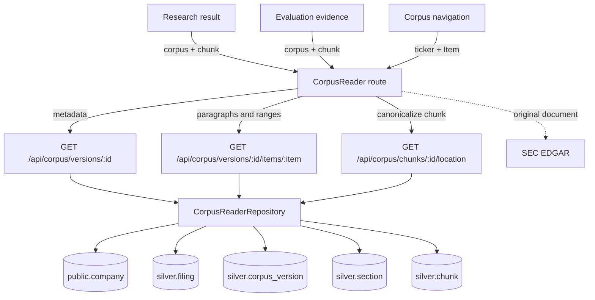
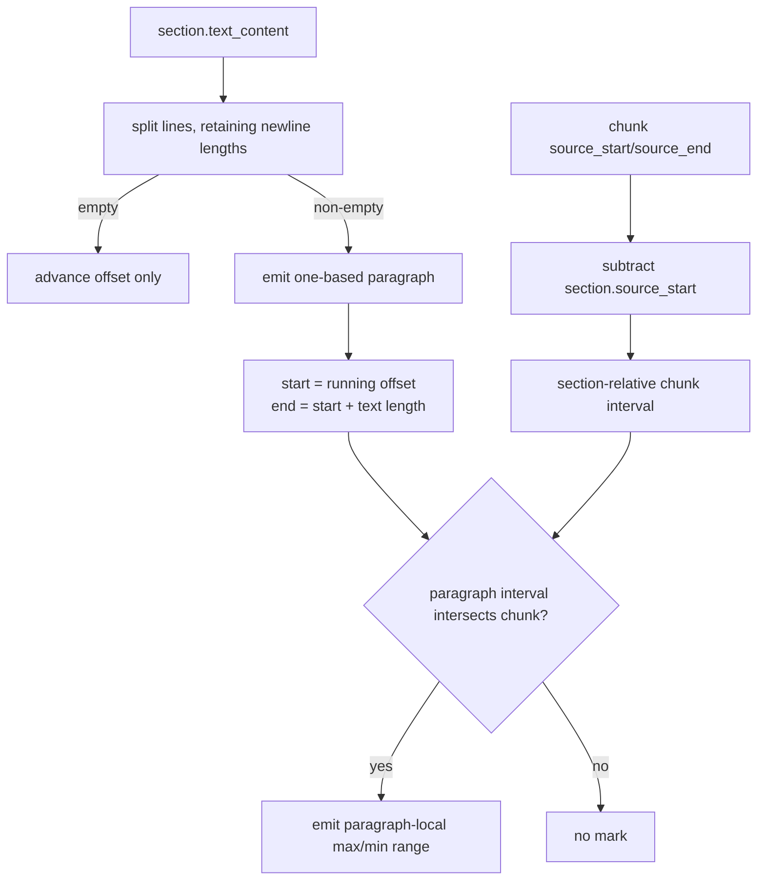
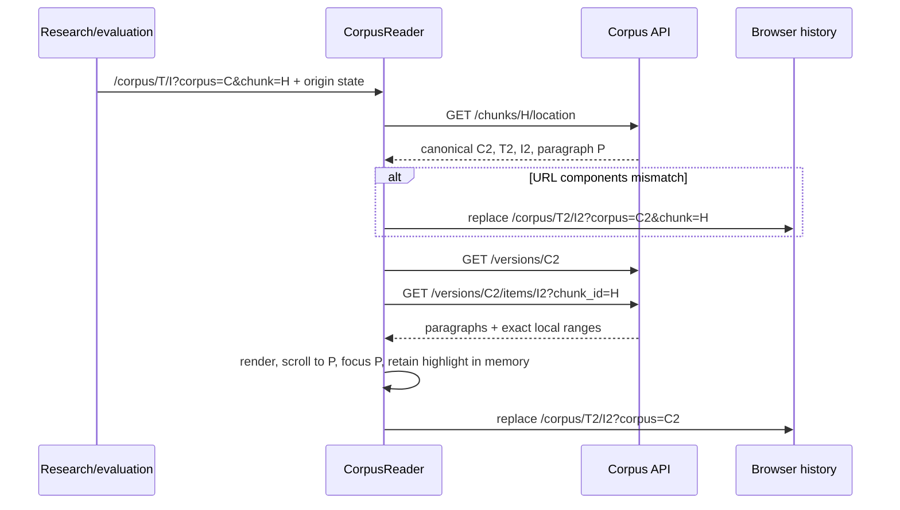
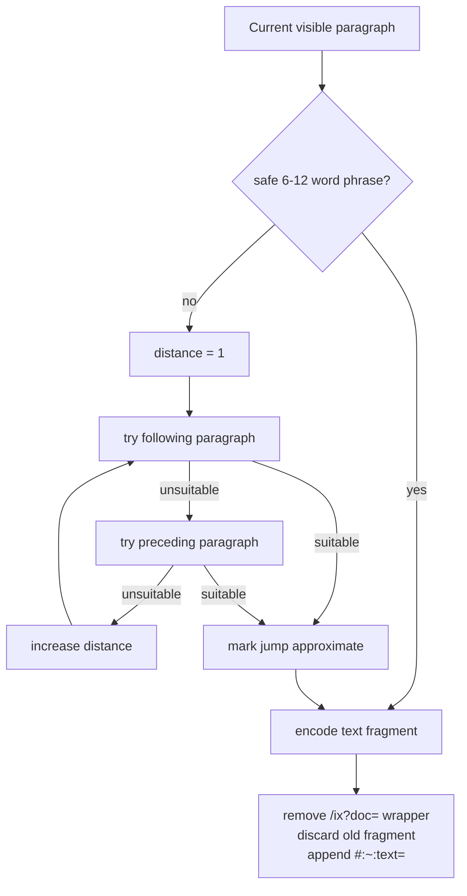

# Corpus reader

The corpus reader is the human-readable view of the exact text used by retrieval. It renders a
complete 10-K Item as source-derived paragraphs, highlights the exact characters occupied by a
retrieved chunk, and links research and evaluation evidence back to that context. It is read-only:
it does not parse, re-ingest, re-chunk, embed, or mutate corpus data.

For the business, this closes the gap between a generated claim and its source context. Reviewers
can inspect the surrounding disclosure, verify what the model received, follow historical evidence
after active filings change, and open the original EDGAR document. For RAG engineering, the reader
makes chunk boundaries and provenance observable instead of hiding them behind a citation label.


## Component and data flow



The read path deliberately stops at silver. `gold.search_document` is a denormalized retrieval
projection and is not authoritative for section-relative offsets. The location query joins
`silver.chunk → silver.section → silver.corpus_version → silver.filing → public.company` and checks
the redundant foreign-key relationships while doing so.

The implementation is split across:

- `repositories/corpus_reader.py`: read-only joins, paragraph derivation, and interval slicing.
- `schemas/corpus_reader.py`: public response contracts and the six allowed Items.
- `api/routers/public/corpus.py`: validated public endpoints and 404 translation.
- `frontend/src/corpus.ts`: reader types and pure EDGAR/keyboard helpers.
- `frontend/src/pages/CorpusReader.tsx`: loading, canonical routing, focus, rendering, and controls.
- `Evidence.tsx` and `ResearchResult.tsx`: entry links carrying optional origin state.

## Public API

All endpoints accept only ready corpus data. A syntactically malformed UUID, chunk hash, or Item is
rejected with `422`; a well-formed identifier that is missing, non-ready, or relationally
inconsistent returns `404`.

### `GET /api/corpus/versions/{corpus_version_id}`

Returns filing/company metadata and all six Item summaries in canonical order: `1`, `1A`, `3`, `7`,
`7A`, `8`. Each summary includes coverage status/reason and paragraph, character, and chunk counts.
`is_active` and `active_corpus_version_id` let the client explain historical views.

The UUID selects the corpus directly. The query intentionally does not filter on
`public.company.enabled`, so a saved link to a ready historical corpus remains readable after its
company is removed from free-browsing configuration.

### `GET /api/corpus/versions/{corpus_version_id}/items/{item}`

Returns the complete Item and never paginates it. A paragraph has:

```json
{
  "index": 42,
  "start": 12340,
  "end": 12718,
  "text": "Exact source line text…",
  "is_furniture": false
}
```

`index` is one-based. `start` and `end` are zero-based, section-relative, and end-exclusive. When
`chunk_id` is supplied, the response additionally contains chunk metadata and paragraph-local
highlight ranges. The chunk must belong to both the requested section and corpus.

### `GET /api/corpus/chunks/{chunk_id}/location`

Returns the chunk's canonical ready corpus, ticker, Item, first intersecting paragraph,
section-relative span, and citation handle. Citation destinations use this endpoint even though
research/evaluation DTOs already contain `corpus_version_id`: the lookup detects stale or mismatched
URLs and provides the canonical route components.

The generated, reviewable contracts are `api/openapi.yaml` and `api/sec-filing-rag.http`.

## Paragraph and highlight arithmetic

`silver.section.text_content` is the source of truth. Every non-empty source line becomes one
paragraph. Empty lines contribute to offsets but not paragraph numbering. Text is never trimmed,
coalesced, or deleted; this includes one-character lines and table cells. A recognizable
`<company> | <year> Form 10-K | <page>` line is only flagged as furniture for reduced visual
emphasis.



For a chunk interval `[Cstart, Cend)` and paragraph interval `[Pstart, Pend)`, intersection exists
only when `max(Cstart, Pstart) < min(Cend, Pend)`. The local mark subtracts `Pstart` from both
intersection bounds. Strict inequality matters: a chunk ending exactly where the next paragraph
begins must not highlight that paragraph. Newlines can occupy the chunk interval but are not marked.

## Routes and canonicalization

| URL | Meaning |
| --- | --- |
| `/corpus` | First configured, enabled company with a ready active corpus; Item 1 |
| `/corpus/:ticker/:item` | Active corpus for free browsing |
| `/corpus/:ticker/:item?corpus=:uuid` | Pinned active or historical corpus |
| `...?corpus=:uuid&chunk=:sha256` | Validate, load, mark, scroll, and focus a chunk |
| `...?corpus=:uuid#p-N` | Stable paragraph deep link without transient highlighting |

The corpus UUID is authoritative. If its company differs from the route ticker, the route is
replaced with the corpus's ticker. A chunk is even more specific: its location supplies the corpus,
ticker, and Item. Canonicalization uses history replacement so an incorrect intermediate URL does
not become an extra Back-button stop.



Removing `chunk` after focus makes copied/shared URLs stable. The page keeps a small in-memory
`retainedChunk` key so the replace-render does not immediately refetch the unhighlighted Item. The
highlight is transient and is cleared on company, corpus, or Item changes.

Router state may contain `{origin: {to, label}}` for a breadcrumb back to the research or evaluation
screen. This state is not serialized into the URL, so bookmarks and copied links remain clean.

## Reader behavior and special handling

- The rail always presents all six Items, including absent or failed Items. Those views show the
  recorded safe reason and remain reachable through previous/next traversal.
- Changing company or filing retains the selected Item, clears chunk/paragraph context, and starts
  at the top. Historical views show a notice and an active-version link.
- Every Item is rendered completely. This preserves browser Find across large Items and avoids
  pagination, reveal windows, and virtualization.
- An `IntersectionObserver` tracks the paragraph near the reading line for sticky controls. It does
  not rewrite the hash while the user scrolls.
- Chunk entry scrolls and moves keyboard focus to the first marked paragraph. Paragraphs use
  `tabIndex=-1`, so programmatic focus does not add hundreds of tab stops.
- Left/Right Arrow and `[`/`]` traverse Items. Modified keystrokes and events from links, buttons,
  fields, selects, text areas, editable regions, or button roles are ignored.
- Copy links always include `?corpus=` and `#p-N`; they exclude chunk and router state. Clipboard
  failures produce visible feedback.
- Items 7, 7A, and 8 warn that table cells are faithful plain text and are often easier in EDGAR.

## EDGAR text fragments

The EDGAR action derives a phrase of 6–12 safe Unicode words from the current paragraph and appends
it as `#:~:text=<encoded phrase>`. A phrase never crosses a paragraph boundary. If the paragraph is
unsuitable, candidates are checked by increasing distance, with the following paragraph winning
ties; the UI labels this as an approximate jump.



Inline-XBRL viewer URLs are defensively unwrapped from `/ix?doc=`. Chromium is the exact-jump
acceptance target. Unsupported browsers, normalization mismatch, or a non-unique phrase can fall
back to the filing top; copying paragraph text and the EDGAR table of contents remain manual paths.

## Extension and debugging guidance

- Keep paragraph derivation server-side and deterministic. Changing extracted or stored text is an
  ingestion compatibility decision, not a reader change.
- Do not resolve offsets from `gold.search_document`; preserve the silver joins and consistency
  predicates.
- Do not omit `corpus_version_id` from stored-result links. Active pointers can move later.
- Test Back/Forward semantics as well as final URLs. Corrections replace; deliberate navigation
  pushes.
- Test Unicode, blank and one-character lines, multi-paragraph spans, and exact boundaries when
  changing highlight arithmetic.
- Keep the asynchronous completion guard: an older request must not overwrite a newer route.

Useful checks:

```bash
# Verify backend paragraph offsets and highlight slicing.
uv run pytest tests/unit/test_corpus_reader.py

# Verify frontend reader helpers and application routes.
npm --prefix frontend run test

# Confirm the documented reader API artifacts are current.
uv run sec-rag-export-openapi --check
uv run sec-rag-generate-http --check
```
