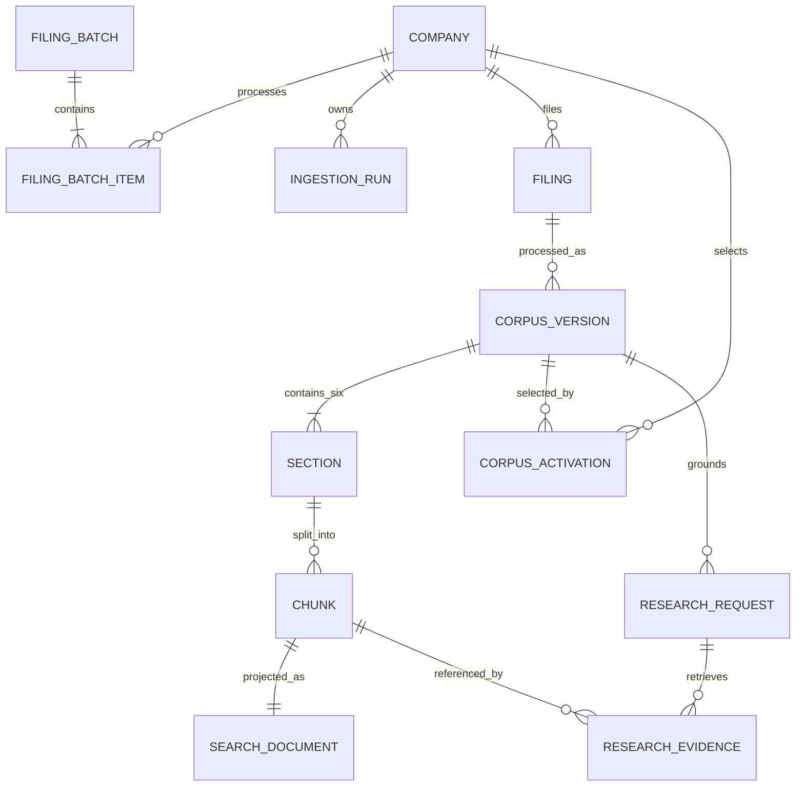
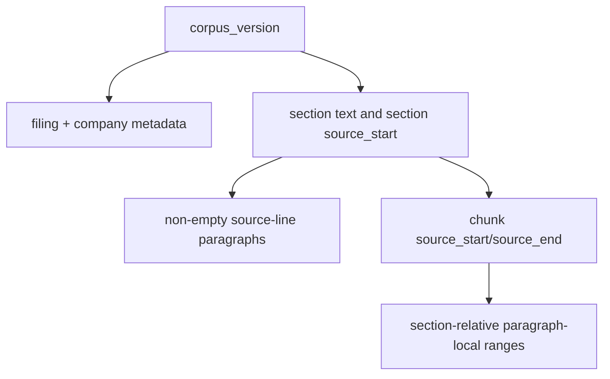

# Database schema

The application schema is an audit-oriented store for source lineage, corpus versions, workflow
references, research, and evaluation. Numbered migrations under `migrations/versions` are immutable;
`public.schema_migration` records their checksums.

## Principal relationships

The diagram omits audit/support tables for readability. PostgreSQL foreign keys and checks enforce
the actual ownership model.

## Public control and audit tables

- `configuration_version` stores normalized company configuration and SHA-256.
- `company` stores configured ticker identity, enablement, SEC resolution, and bounded errors.
- `filing_batch` stores latest/exact-year intent, optional fiscal year, request/execution
  correlation, aggregate status, timestamps, and safe error.
- `filing_batch_item` stores ordered company work, lifecycle, selected accession, acquisition/corpus
  references, timestamps, and safe error.
- `ingestion_run` and `ingestion_stage` record processing compatibility, stage counts, times, and
  terminal outcomes.
- `corpus_activation` stores default history; a partial unique index permits one live default per
  company.

The application database stores references to Kestra execution IDs but has no foreign keys to
Kestra PostgreSQL.

## Bronze: immutable source evidence

`bronze.filing_acquisition` is the persisted boundary between provider acquisition and corpus
processing. It stores primitive provider metadata, exact HTML bytes, media type, byte length,
checksum, company, accession, and acquisition time.

Company, filing, and document snapshot tables preserve canonical provider lineage. Mutation triggers
reject updates/deletes, and checksum uniqueness provides replay identity. Bronze answers “what did
the source/provider supply?” rather than “what text did retrieval use?”

## Silver: application corpus authority

- `silver.filing` identifies one original filing by CIK and accession and links source snapshots.
- `silver.corpus_version` identifies one processing-compatible representation of a filing and stores
  parser, chunker, embedding, index, source checksum, lifecycle, and readiness.
- `silver.section` stores one of six Item coverage outcomes, exact normalized text, source offsets,
  checksum, parser version, and safe reason.
- `silver.chunk` stores deterministic identity, section/corpus relationships, ordinal, text, filing
  offsets, citation, version, and checksum.

Silver is authoritative for source text, corpus version, citation identity, and offsets. Research
evidence hydration and the corpus reader join silver rather than trusting a denormalized search row.

## Gold: retrieval projection

`gold.search_document` has one row per chunk with company/corpus/filing/Item filter keys, repeated
text and citation, JSON provenance, embedding contract, vector, and lexical document. PostgreSQL BM25
is pinned to English; B-tree indexes support prefilters before scoring.

`gold.corpus_status` summarizes the active default's filing, coverage, counts, embedding usage,
activation, and latest successful ingestion. Gold is replaceable: it accelerates search but does not
own source truth.

## Research, feedback, and usage

`research_request` preserves exact input, corpus UUID, optional idempotency key, accession, prompt
and configuration hashes, pricing snapshot, lifecycle, and error. `research_evidence` records ranked
chunk lineage only. `research_result` stores validated structured output, limitations, independent
evidence/policy states, disposition, and deterministic rejection message.

`feedback` provides one foreign-key-backed, upsertable rating per research result. `llm_usage` can
belong to at most one ingestion, retrieval evaluation, ground-truth generation, research request, or
generation evaluation. It records operation, model, tokens, attempts/retries, provider timestamps,
latency, and normalized status.

Prompt text, secrets, authorization headers, and raw provider request/response payloads are
intentionally absent.

## Evaluation lineage

`retrieval_evaluation_run`, `ground_truth_generation_run`, and generation-evaluation ownership on
usage rows preserve checksums, selected configuration/model, status, and bounded failures. Large
review and result artifacts remain checked-in files; database rows provide run identity and audit,
not a second editable copy.

## Corpus-reader read model

The reader adds no migration. It derives paragraphs and highlight ranges at read time:

`chunk.source_start - section.source_start` converts a filing-relative chunk boundary into the
section coordinate system. Exact interval behavior is documented in
[Corpus reader](corpus-reader.md) and the authority decision in
[ADR 0003](decisions/0003-silver-source-offset-authority.md).

## Integrity and migration rules

Important constraints include unique ticker/configuration identity, ordered unique batch items,
filing CIK/accession, filing/compatibility, section Item, chunk ordinal/citation, search chunk ID, and
one active corpus per company. Candidate persistence performs higher-level cross-table validation
before ready state.

Apply migrations with `uv run sec-rag-migrate`. Never edit a migration that may have been applied;
add the next numbered file. Recovery and destructive reset belong to [Operations](operations.md).
