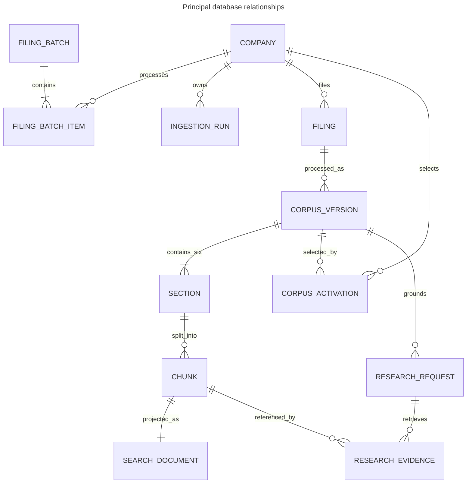
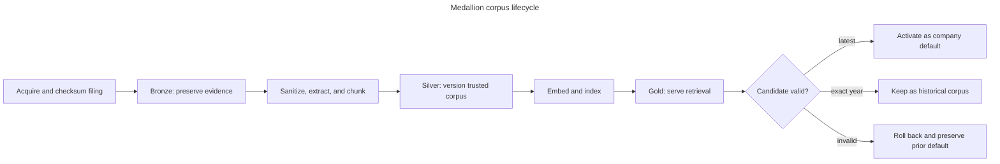
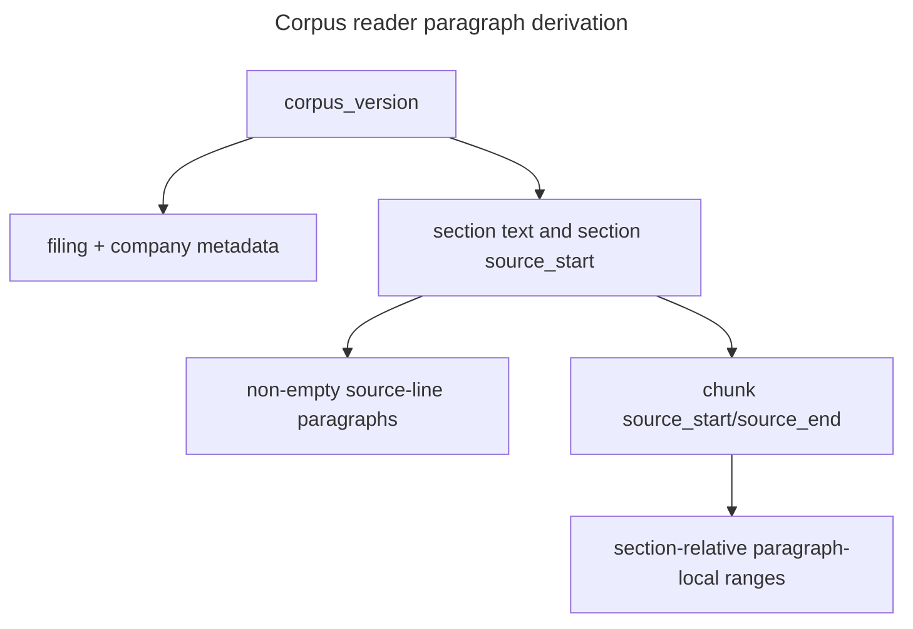

# Database schema

The application schema is an audit-oriented store for source lineage, corpus versions, workflow
references, research, and evaluation. Numbered migrations under `migrations/versions` are immutable;
`public.schema_migration` records their checksums.

## Medallion design

The filing corpus uses a medallion-style design: bronze preserves what was acquired, silver turns
that evidence into governed application knowledge, and gold serves a search-optimized projection.
Each layer has one clear responsibility, so source evidence, citation truth, and search performance
can evolve without silently changing one another.

This separation also creates a controlled path for progressive transformation. Bronze retains the
original filing, silver can clean and enrich its content, and gold can publish representations tuned
for particular consumers. A transformation is not a benefit merely because it changes data: the
benefit is that it can be versioned, validated, traced to its input, and rerun without reacquiring or
overwriting the source.

| Schema | Positioning and goal | Produced by | Primary consumers | Distinctive data | Principal benefit |
| --- | --- | --- | --- | --- | --- |
| Bronze | Preserve provider evidence before application transformations | SEC acquisition and transactional corpus persistence | Ingestion, lineage inspection, and audit | Exact HTML bytes, provider snapshots, acquisition metadata, byte lengths, and source checksums | A filing can be verified and processed again from the evidence actually received |
| Silver | Govern the normalized, versioned corpus and own citation truth | Sanitization, Item extraction, deterministic chunking, and candidate validation | Corpus reader, citations, research evidence hydration, activation, and evaluation | Compatibility keys, lifecycle state, explicit coverage, normalized text, stable chunk IDs, citation handles, and source offsets | Research remains reproducible when filings or processing settings change |
| Gold | Serve a replaceable, search-optimized projection | Embedding and persistence of validated silver chunks | Keyword, vector, and hybrid retrieval; evaluation; corpus-status reads | Repeated filter keys, provenance, embeddings, lexical documents, and search indexes | Retrieval stays fast without making the index the source of truth |

The `public` schema is the control plane around these layers. It records configuration, users,
batches, ingestion stages, activation history, research, evaluation, model usage, cost, and audit
events. Those records explain who requested work, which corpus is active, and what happened; they
are operational state rather than another stage of filing refinement.

## Principal relationships

The diagram omits audit/support tables for readability. PostgreSQL foreign keys and checks enforce
the actual ownership model.

## Public control and audit tables

- `configuration_version` stores normalized company configuration and SHA-256.
- `company` stores configured ticker identity, enablement, SEC resolution, and bounded errors.
- `filing_batch` stores latest/exact-year intent, optional fiscal year, public request and unique
  scheduled-launcher correlation, processing execution correlation, aggregate status, timestamps,
  and safe error.
- `filing_batch_item` stores ordered company work, lifecycle, selected accession, acquisition/corpus
  references, timestamps, and safe error.
- `ingestion_run` and `ingestion_stage` record processing compatibility, stage counts, times, and
  terminal outcomes.
- `corpus_activation` stores default history; a partial unique index permits one live default per
  company.

The application database stores references to Kestra execution IDs but has no foreign keys to
Kestra PostgreSQL.

## Bronze: preserve source evidence

`bronze.filing_acquisition` is the persisted boundary between provider acquisition and corpus
processing. It stores primitive provider metadata, exact HTML bytes, media type, byte length,
checksum, company, accession, and acquisition time.

During acquisition, the application inserts or reuses these records:

- `filing_acquisition` safely hands an acquired filing from batch execution to corpus processing.
- `edgar_company_snapshot` captures the provider's company identity and descriptive metadata.
- `edgar_filing_snapshot` captures accession, dates, form, document identity, and SEC URLs.
- `edgar_filing_document` stores the selected original `10-K` document and its exact UTF-8 HTML.

The snapshot tables reject updates and deletes. Canonical metadata hashes deduplicate equivalent
snapshots, while content length and SHA-256 fields make source integrity directly testable. The
acquisition row is idempotent for a company, accession, and content checksum; unlike the three
snapshot tables, its insert-only behavior currently relies on application ownership rather than a
mutation trigger.

Bronze answers “what did the provider supply?” Its main achievement is a replayable evidence
boundary: later parser or index changes never require treating a derived search row as the original
filing.

## Silver: govern the application corpus

After source validation, the pipeline sanitizes HTML, extracts six supported Items, creates
deterministic chunks, and writes:

- `silver.filing`, the canonical original filing identified by CIK and accession and linked to the
  exact bronze snapshots and document.
- `silver.corpus_version`, one processing-compatible representation of that filing, including its
  source checksum, parser, chunker, embedding, dimensions, index contract, lifecycle, and readiness.
- `silver.section`, exactly one coverage outcome for each supported Item, with normalized text,
  filing-relative offsets, checksum, parser version, and a safe reason where applicable.
- `silver.chunk`, a deterministic passage identity with section and corpus lineage, ordinal, exact
  text, filing-relative offsets, stable citation handle, version, and checksum.

The compatibility key binds the source checksum and all processing versions. A material source,
parser, chunker, embedding, dimension, or index change therefore creates a distinct corpus instead
of silently rewriting an old one. Coverage states distinguish present content and legitimate
absence from extraction failure. Candidate validation requires complete coverage and consistent
chunks before the corpus becomes ready.

Silver is authoritative for source text, corpus version, citation identity, and offsets. Research
evidence hydration and the corpus reader join silver rather than trusting a denormalized search row.
This gives readers stable highlights and lets stored research pin the exact evidence used even after
a newer filing becomes active.

Today, silver sanitization removes scripts, styles, active and hidden elements, controls, comments,
and unwanted formatting characters; normalizes the remaining text; extracts supported Items; and
represents tables as plain text. The same boundary can later add versioned table reconstruction,
footnote and exhibit structure, OCR, and image or chart descriptions while preserving links to the
original bronze document. These would be new processing capabilities, not changes to bronze source
evidence.

## Gold: serve the retrieval projection

`gold.search_document` has one row per chunk with company/corpus/filing/Item filter keys, repeated
text and citation, JSON provenance, embedding contract, vector, and lexical document. PostgreSQL BM25
is pinned to English; B-tree indexes support prefilters before scoring.

Gold is generated in the same transaction as its silver candidate after embeddings are returned.
Before activation, validation checks one-to-one silver/gold counts, matching text and citations,
valid vectors, source offsets, and required provenance. Retrieval then combines indexed keyword and
semantic candidates while pinning the company, filing, and corpus version.

`gold.corpus_status` summarizes the active default's filing, coverage, counts, embedding usage,
activation, and latest successful ingestion. Gold is replaceable: it accelerates search but does not
own source truth. That separation allows search representation and indexing strategies to be rebuilt
without moving citation coordinates or altering historical research.

Gold can consequently evolve into multiple workload-specific projections. Narrative passages,
structured financial tables, visual-content descriptions, graph relationships, or analytical facts
could each receive an appropriate search or serving representation while silver remains the common
governed authority.

## Layer lifecycle and activation

Bronze, silver, and gold candidate records are persisted together transactionally. A company row
lock serializes activation, and a partial unique index permits at most one live default per company.
Latest processing can activate a validated version; exact-year processing keeps a ready historical
version. Research and evidence reference corpus and chunk identities directly, so changing the
default never retargets prior answers.

This design delivers several practical benefits:

- complete lineage from a cited answer to normalized text and original filing bytes;
- repeatable research and evaluation across source and processing versions;
- safe reuse of a compatible corpus without repeated embedding cost;
- atomic promotion that cannot replace a working corpus with a partial candidate;
- independent optimization or rebuilding of the search projection;
- progressive cleaning and enrichment of text, tables, and images without losing source fidelity;
- reuse of bronze and silver data when only a parser, embedding, or serving strategy changes;
- specialized serving models for narrative, structured, visual, relational, or analytical workloads;
- observable failures and per-company isolation without querying the workflow engine.

Together, these properties support progressive data-quality improvement, safe experimentation, and
clear governance: operators can identify what was acquired, what was derived, which transformation
produced it, and which representation was used by a consumer.

## Research, feedback, and usage

`research_request` preserves exact input, corpus UUID, optional idempotency key, accession, prompt
and configuration hashes, pricing snapshot, lifecycle, and error. `research_evidence` records ranked
chunk lineage only. `research_result` stores validated structured output, limitations, independent
evidence/policy states, disposition, and deterministic rejection message.

`feedback` provides one foreign-key-backed, upsertable rating per research result. `llm_usage` can
belong to at most one ingestion, retrieval evaluation, ground-truth generation, research request, or
generation evaluation. It records operation, model, tokens, attempts/retries, provider timestamps,
latency, and normalized status.

Prompt text, secrets, authorization headers, and raw provider request/response payloads are
intentionally absent.

## Evaluation lineage

`retrieval_evaluation_run`, `ground_truth_generation_run`, and generation-evaluation ownership on
usage rows preserve checksums, selected configuration/model, status, and bounded failures. Large
review and result artifacts remain checked-in files; database rows provide run identity and audit,
not a second editable copy.

## Corpus-reader read model

The reader adds no migration. It derives paragraphs and highlight ranges at read time:

`chunk.source_start - section.source_start` converts a filing-relative chunk boundary into the
section coordinate system. Exact interval behavior is documented in
[Corpus reader](corpus-reader.md) and the authority decision in
[ADR 0003](decisions/0003-silver-source-offset-authority.md).

## Integrity and migration rules

Important constraints include unique ticker/configuration identity, ordered unique batch items,
filing CIK/accession, filing/compatibility, section Item, chunk ordinal/citation, search chunk ID, and
one active corpus per company. Candidate persistence performs higher-level cross-table validation
before ready state.

Apply migrations with `uv run sec-rag-migrate`. Never edit a migration that may have been applied;
add the next numbered file. Recovery and destructive reset belong to [Operations](operations.md).

## Future review checklist

The current model establishes the intended authority and activation boundaries. Future hardening or
scale reviews can consider:

- applying database-enforced insert-only behavior to `bronze.filing_acquisition`;
- adding direct range checks for section and chunk offsets;
- enforcing redundant filing, corpus, and embedding relationships with composite constraints where
  that does not make ingestion needlessly rigid;
- adding an approximate vector index when corpus size and measured query plans justify it;
- defining long-term evidence retention and schema-specific database roles and grants;
- replacing textual aggregation in `gold.corpus_status` if usage status needs an explicit severity
  order.
