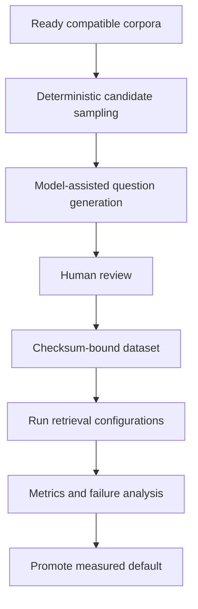
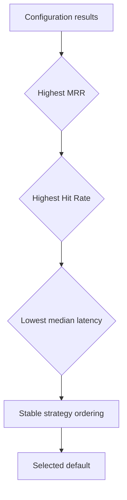

# Evaluation

Evaluation determines whether retrieval finds the evidence a grounded answer needs. A RAG system
can produce fluent text even when retrieval is weak, so generation quality alone is not sufficient.
This project uses human-reviewed questions, exact relevant chunk identifiers, repeatable
configuration grids, and explicit selection rules to make retrieval quality measurable.

## Evaluation lifecycle

Model assistance proposes questions; it does not establish ground truth. A human accepts or rejects
source chunks and questions, may correct question wording and labels, and signs off on coverage.
Finalization then binds accepted cases to corpus, configuration, prompt, and dataset checksums.

The detailed commands and review procedure remain in
[Retrieval ground-truth preparation and review](../evaluation/REVIEW.md).

## Ground truth

Ground truth is a reviewed investor question linked to one or more filing chunk IDs that retrieval
should return. It is not a generated answer. Each case records company, accession, corpus version,
allowed Items, research goal, query type, and relevant chunks.

Two query types test complementary behavior:

- **Exact keyword:** uses material wording likely to occur in the filing and rewards lexical
  precision.
- **Semantic paraphrase:** expresses the same information need without relying on identical words
  and tests meaning-based retrieval.

Coverage spans configured companies, all six Items, five research goals, and legal/non-legal risk
cases. Generation shortfalls are warnings that require review; a structurally valid but narrow
dataset can still produce misleadingly strong metrics.

## Retrieval strategies

| Strategy | Principle | Strength | Trade-off |
| --- | --- | --- | --- |
| Keyword BM25 | Scores term occurrence and rarity | Exact filing language, names, figures | Misses paraphrases |
| Vector | Compares embedding similarity | Semantic intent and alternate wording | Can rank broadly related text |
| Weighted hybrid | Normalizes and combines keyword/vector scores | Balances exact and semantic evidence | Requires a measured weight `alpha` |
| Reciprocal-rank fusion (RRF) | Combines result ranks rather than raw scores | Robust across incomparable score scales | Requires a rank constant and candidate depth |

The benchmark evaluates parameterized configurations under the same reviewed cases. Retrieval uses
one pinned corpus per case, so changes in active defaults cannot change the benchmark silently.

## Metrics

- **Hit Rate:** fraction of questions with at least one relevant chunk inside the returned top-k.
  It answers “did retrieval find usable evidence?”
- **Mean Reciprocal Rank (MRR):** average of `1 / first relevant rank`. A relevant result at rank one
  contributes `1`; rank four contributes `0.25`. MRR rewards evidence appearing early.
- **Median latency:** middle retrieval duration across cases. It describes responsiveness without
  letting a few extreme calls dominate.

The deterministic selection order prevents subjective promotion after results are visible. Metrics
must be read with coverage, warnings, and per-question misses; a headline average cannot explain a
systematic failure in a high-value Item.

## Accepted retrieval baseline

The accepted `retrieval-v1` benchmark contains 96 reviewed questions across AAPL, MSFT, and NVDA,
all five goals, all six Items, and both query types. Its selected configuration is weighted hybrid
with `candidate_count=10`, `top_k=10`, and `alpha=0.25`. The recorded result achieved Hit Rate `1.0`
and MRR approximately `0.940`; eleven cases placed their first relevant chunk below rank one.

These numbers describe the checked-in corpus and dataset, not a universal performance guarantee.
They establish a reproducible regression baseline and demonstrate measured configuration selection.
The authoritative values and checksums remain in the evaluation artifacts.

## Artifacts and lineage

| Artifact | Purpose |
| --- | --- |
| `ground-truth-review-v1.json` | Editable model-assisted review bundle |
| `retrieval-v1.jsonl` | Final accepted cases |
| `retrieval-v1-manifest.json` | Corpus/configuration lineage and coverage |
| `results/retrieval-v1.json` | Per-configuration and per-question results |
| `results/retrieval-v1.md` | Human-readable benchmark summary |

Database audit rows preserve run status and checksums; usage rows preserve provider operations.
Validation rejects malformed artifacts, changed datasets, inconsistent winners, incomplete question
sets, or missing referenced chunks.

## Dashboard and evidence inspection

The `/evaluation` route presents the selected winner, strategy comparison, metrics, filters,
warnings, and question outcomes. Question detail shows expected and retrieved chunks, relevance,
full text, technical provenance, EDGAR source, and a corpus-pinned reader link. URL-backed filters
make a diagnostic view repeatable without changing benchmark artifacts.

## Rerun and promotion policy

Rerun the benchmark when the corpus snapshot, reviewed ground truth, embedding contract, retrieval
configuration grid, scoring logic, filtering, or chunking changes. A command completing successfully
proves integrity, not quality. Promotion requires valid checksums, complete expected cases, reviewed
warnings and misses, and the deterministic selection rule.

Generation evaluation is separate: it judges answer behavior after retrieval and applies citation
and policy gates. Its operational validation and promotion commands live in
[Operations](operations.md); retrieval benchmark preparation remains in the review runbook.
