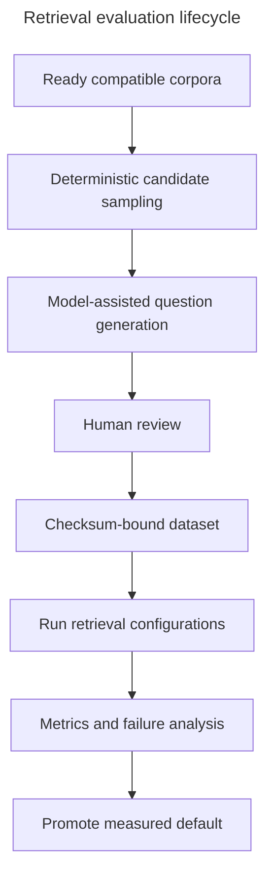
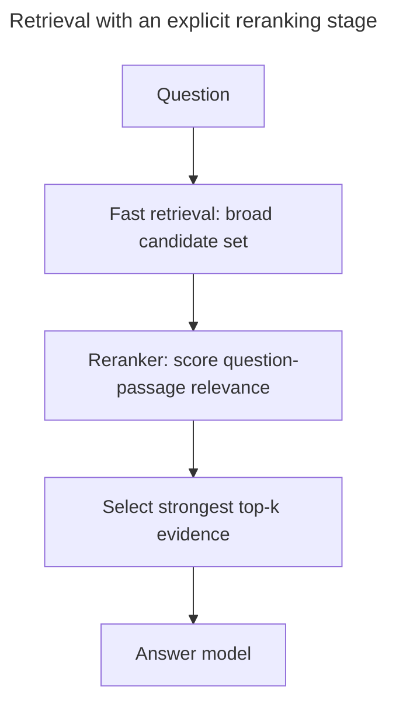
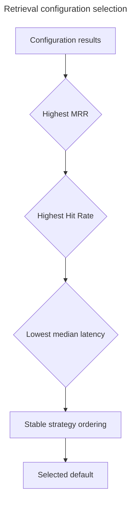

# Evaluation

Evaluation determines whether retrieval finds the evidence a grounded answer needs. A RAG system
can produce fluent text even when retrieval is weak, so generation quality alone is not sufficient.
This project uses human-reviewed questions, exact relevant chunk identifiers, repeatable
configuration grids, and explicit selection rules to make retrieval quality measurable.

For dataset construction, including how the model-assisted prompt affects retrieval ground truth,
use [Ground-truth question-generation prompt](retrieval-evaluation-workflow.md#ground-truth-question-generation-prompt).
For prompt and answer evaluation across the complete path, start with
[Prompt roles in full-RAG evaluation](rag-evaluation-workflow.md#prompt-roles-in-full-rag-evaluation).
This page remains the high-level overview of the project's current model and accepted results.

## Evaluation lifecycle

Model assistance proposes questions; it does not establish ground truth. A human accepts or rejects
source chunks and questions, may correct question wording and labels, and signs off on coverage.
Finalization then binds accepted cases to corpus, configuration, prompt, and dataset checksums.

The detailed commands and review procedure remain in
[Retrieval ground-truth preparation and review](../evaluation/REVIEW.md).

## Ground truth

Ground truth is a reviewed investor question linked to one or more filing chunk IDs that retrieval
should return. It is not a generated answer. Each case records company, accession, corpus version,
allowed Items, research goal, query type, and relevant chunks.

Two query types test complementary behavior:

- **Exact keyword:** uses material wording likely to occur in the filing and rewards lexical
  precision.
- **Semantic paraphrase:** expresses the same information need without relying on identical words
  and tests meaning-based retrieval.

Coverage spans configured companies, all six Items, five research goals, and legal/non-legal risk
cases. Generation shortfalls are warnings that require review; a structurally valid but narrow
dataset can still produce misleadingly strong metrics.

## Retrieval strategies

| Strategy | Principle | Strength | Trade-off |
| --- | --- | --- | --- |
| Keyword BM25 | Scores term occurrence and rarity | Exact filing language, names, figures | Misses paraphrases |
| Vector | Compares embedding similarity | Semantic intent and alternate wording | Can rank broadly related text |
| Weighted hybrid | Normalizes and combines keyword/vector scores | Balances exact and semantic evidence | Requires a measured weight `alpha` |
| Reciprocal-rank fusion (RRF) | Combines result ranks rather than raw scores | Robust across incomparable score scales | Requires a rank constant and candidate depth |

The benchmark evaluates parameterized configurations under the same reviewed cases. Retrieval uses
one pinned corpus per case, so changes in active defaults cannot change the benchmark silently.

### Future improvement: explicit evidence reranking

The current retrieval path finds keyword and vector candidates, fuses their scores, and sends only
the configured top-k passages to answer generation. A future reranking stage could take the larger
candidate set and perform a second, more focused comparison between the complete question and each
passage before choosing that top-k:

A reranker can be a small local cross-encoder, a hosted reranking service, or a general-purpose LLM.
The preferred first experiment for this project is a small local cross-encoder: it is specialized
for relevance scoring, avoids another external LLM request, and keeps the answer prompt bounded. An
LLM reranker may help with nuanced questions, but adds provider cost, latency, and output-consistency
concerns and must be evaluated separately.

Passing every candidate directly to the answer model is a useful larger-context baseline, but it is
not equivalent to explicit reranking. In that approach, one model must identify evidence and write
the answer simultaneously; weak passages consume context and can distract from stronger evidence.
Explicit reranking separates those responsibilities, makes relevance quality independently
measurable, and reserves answer-model context for the passages most likely to support a response.

Any reranker should be promoted only when benchmark results show that improved retrieval and answer
quality justify its additional latency and compute. Evaluation should compare at least the current
top-k baseline, passing the full candidate set to generation, and reranking candidates before the
same bounded top-k generation step.

## Metrics

- **Hit Rate:** fraction of questions with at least one relevant chunk inside the returned top-k.
  It answers “did retrieval find usable evidence?”
- **Mean Reciprocal Rank (MRR):** average of `1 / first relevant rank`. A relevant result at rank one
  contributes `1`; rank four contributes `0.25`. MRR rewards evidence appearing early.
- **Median latency:** middle retrieval duration across cases. It describes responsiveness without
  letting a few extreme calls dominate.

The deterministic selection order prevents subjective promotion after results are visible. Metrics
must be read with coverage, warnings, and per-question misses; a headline average cannot explain a
systematic failure in a high-value Item.

## Accepted retrieval baseline

The accepted `retrieval-v1` benchmark contains 96 reviewed questions across AAPL, MSFT, and NVDA,
all five goals, all six Items, and both query types. Its selected configuration is weighted hybrid
with `candidate_count=10`, `top_k=10`, and `alpha=0.25`. The recorded result achieved Hit Rate `1.0`
and MRR approximately `0.940`; eleven cases placed their first relevant chunk below rank one.

These numbers describe the checked-in corpus and dataset, not a universal performance guarantee.
They establish a reproducible regression baseline and demonstrate measured configuration selection.
The authoritative values and checksums remain in the evaluation artifacts.

## Artifacts and lineage

| Artifact | Purpose |
| --- | --- |
| `ground-truth-review-v1.json` | Editable model-assisted review bundle |
| `retrieval-v1.jsonl` | Final accepted cases |
| `retrieval-v1-manifest.json` | Corpus/configuration lineage and coverage |
| `results/retrieval-v1.json` | Per-configuration and per-question results |
| `results/retrieval-v1.md` | Human-readable benchmark summary |

Database audit rows preserve run status and checksums; usage rows preserve provider operations.
Validation rejects malformed artifacts, changed datasets, inconsistent winners, incomplete question
sets, or missing referenced chunks.

## Public overview, dashboards, and evidence inspection

The public `/evaluation` route explains the benefit of grounding an existing LLM in current source
material without training a custom model. It anchors results to reviewed-question counts and the
best tested keyword baseline, visualizes where expected evidence ranked, names the active and
evaluated models by role, and discloses benchmark limitations. Exact metrics remain available in an
expandable technical panel.

The authenticated `/evaluation/evidence-search` route presents the selected retrieval winner,
strategy comparison, exact metrics, filters, warnings, and question outcomes. Question detail shows
expected and retrieved chunks, relevance, full text, technical provenance, EDGAR source, and a
corpus-pinned reader link. URL-backed filters make a diagnostic view repeatable without changing
benchmark artifacts.

The authenticated `/evaluation/answer-quality` route presents the current prompt winner,
business-facing quality, citation, latency, and cost measures, a prompt leaderboard, and a
question-by-prompt verdict matrix. Question detail compares two structured answers and their judge
explanations against shared retrieved evidence. Model identifiers, metric definitions, and exact
checksum-verified prompt source remain available through progressive disclosure.

The public API exposes only curated aggregates and model provenance at
`GET /api/evaluation-overview/current`. Evaluation cases, chunk content, prompt source, full lineage,
and user research remain authenticated.

### Artifact-only deployments

Retrieval and generation aggregates come from the configured, checksum-validated artifacts and
remain available when a deployment does not contain the original evaluation runs or filing chunks
in PostgreSQL. Question rankings and generated answers also remain reviewable after sign-in. The
dashboards warn that operational reconciliation or evidence inspection is unavailable; they do not
misreport the recorded evaluations as failed. Full chunk endpoints remain unavailable until the
matching corpus exists in the deployment.

An administrator restoring a deployment must first follow [Getting started](getting-started.md) to
prepare the required corpus and database records, then follow the
[full-RAG evaluation guide](rag-evaluation-workflow.md) to regenerate and validate an artifact bound
to that corpus. Until both steps are complete, use the artifact-level aggregates and answers for
orientation only and do not treat citation handles as independently reverified evidence.

## Rerun and promotion policy

Rerun the benchmark when the corpus snapshot, reviewed ground truth, embedding contract, retrieval
configuration grid, scoring logic, filtering, or chunking changes. A command completing successfully
proves integrity, not quality. Promotion requires valid checksums, complete expected cases, reviewed
warnings and misses, and the deterministic selection rule.

Generation evaluation is separate: it judges answer behavior after retrieval and applies citation
and policy gates. Its candidate designs are compared in
[Three candidate answer prompts](rag-evaluation-workflow.md#three-candidate-answer-prompts), while
operational validation and promotion commands live in [Operations](operations.md); retrieval
benchmark preparation remains in the review runbook.
