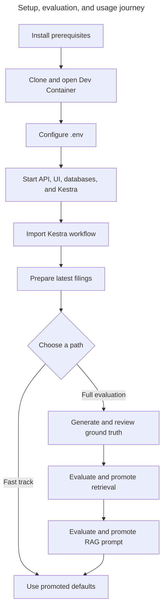

# Getting started: set up, evaluate, and use the system

This guide is the complete path from a fresh clone to a usable SEC filing research system. The
fast track uses the checked-in retrieval and generation defaults. The full evaluation path
reproduces the quality-selection process against corpora created in your own database.
Use the [command reference](commands.md) to look up project CLIs and frontend scripts without
leaving this journey.



## 1. Prerequisites

Install:

- Git;
- Visual Studio Code with the Dev Containers extension;
- Docker Desktop, or another Docker environment compatible with Dev Containers;
- access to Google Cloud console and an OpenAI Platform account;
- a truthful SEC product/contact identity.

Section 3 walks through creating the credentials; you do not need to have them already.

Corpus preparation, embeddings, ground-truth generation, answer generation, and judging use
external services and may incur cost.

## 2. Clone and open the development environment

Clone `https://github.com/hongchit/sec-filing-rag-poc.git` with Git or VS Code, open the repository,
and select **Dev Containers: Reopen in Container**. The first creation installs pinned Python and
frontend dependencies. The container starts isolated application and Kestra PostgreSQL services;
the post-start hook waits for the application database and applies migrations.

## 3. Configure the environment

### Choose where credentials belong

Create provider credentials in your **host browser**, then edit `.env` in the
**Dev Container / app repository root**. This guide runs the application locally at
`http://localhost:5173`; keep `PUBLIC_BASE_URL` set to that value.

| Setting | Where its value comes from |
| --- | --- |
| `OPENAI_API_KEY` | OpenAI Platform project key, created below |
| `GOOGLE_CLIENT_ID`, `GOOGLE_CLIENT_SECRET` | Google Auth Platform web client, created below |
| `GOOGLE_ADMIN_EMAILS` | Your chosen administrator's Google account email |
| `EDGAR_IDENTITY` | Your truthful product name and contact email; this app does not require an SEC API key |
| `SESSION_SECRET`, `INGESTION_API_TOKEN` | Random values you generate, not provider-issued API keys |
| Database and Kestra passwords | Credentials you generate for your own services |

### Create the OpenAI API key — Browser / OpenAI Platform

1. Sign in to the [OpenAI Platform](https://platform.openai.com/). Select the organization and
   project that should own this local app's usage.
2. Check the organization's billing setup and the project's model access and usage controls before
   starting ingestion. Review Usage and Limits with the account owner; an alert threshold should
   not be assumed to stop requests. The application's lifetime allowances are separate controls.
3. Open [API keys](https://platform.openai.com/api-keys) for the selected project and choose
   **Create new secret key**. Name it `sec-rag-local` and store the generated value in your
   password manager.
4. Set `OPENAI_API_KEY` to that value in the runtime file described below. Use a project API key,
   not an organization administration key. Keep it on the backend; do not use a `VITE_` variable.

The code needs Embeddings and Responses access; the optional ground-truth generation path also
uses Chat Completions. If restricting key permissions, allow those operations and the configured
models. Keep the tracked model names and pricing configuration consistent when changing models.
See [OpenAI's key setup](https://developers.openai.com/api/docs/quickstart) and
[production guidance](https://developers.openai.com/api/docs/guides/production-best-practices).

### Model budget: a quick heads-up

Approximate **USD** costs with the default models (`text-embedding-3-small` and `gpt-5.4-mini`):

| Major step | Ballpark cost (USD) |
| --- | --- |
| Ingest the latest filing for all 10 default companies | $0.01–$0.03 total |
| Search/query embeddings, without generating an answer | Less than $0.01 for 100 short queries |
| Generate a research answer | Around $0.01 per answer |
| Generate ground-truth questions | Around $1 for a small run of roughly 100 model calls |
| Evaluate answers and judge quality across 96 cases and three prompts | Around $1–$2 per run |
| View checked-in showcase and evaluation results | $0 in new model usage |

Allow **USD $1–$2 for an initial trial**, or **USD $5–$10 for the full evaluation journey with retries**.
Actual cost varies with filing length, answer length, and reruns; these are estimates, not spending
caps. Based on [tracked pricing](../config/model-pricing-v1.json),
[historical evaluation usage](../evaluation/results/generation-v1.json), and OpenAI's
[embedding](https://developers.openai.com/api/docs/models/text-embedding-3-small) and
[generation](https://developers.openai.com/api/docs/models/gpt-5.4-mini) prices checked on 2026-09-07.

### Set up Google Auth Platform — Browser / Google Cloud console

This application uses Google's server-side OpenID Connect authorization-code flow. You need an
**OAuth client ID and client secret**, not a Google API key, service-account JSON file, or Firebase
configuration. The backend already implements login; no Google JavaScript SDK needs to be added.
See [Google's OpenID Connect setup](https://developers.google.com/identity/openid-connect/openid-connect).

1. Open the [Google Cloud console](https://console.cloud.google.com/), select or create the project
   that will own sign-in, and open **Google Auth Platform**. Select **Get started** if prompted.
2. Enter app name `SEC Filing RAG`, a monitored support email, and developer contact email.
   Choose **External** for personal Google accounts or users outside your Workspace organization.
   **Internal** is appropriate only for an organization-only Workspace application.
3. In **Audience**, initially use Testing and add the administrator's Google account and intended
   testers under **Test users**. This list controls Google-side testing access; it does not grant
   this application's administrator role.
4. In **Data Access**, configure only `openid`, email, and profile. The console may display the
   latter two as `.../auth/userinfo.email` and `.../auth/userinfo.profile`. The code requests
   `openid profile email`; it does not need Drive, Gmail, or Calendar access.

These screens are documented in Google's
[consent-screen setup](https://developers.google.com/workspace/guides/configure-oauth-consent).

In **Branding**, keep the app name and contact details you entered above. For this local trial,
use Testing mode; you do not need a public deployment domain. Do not add `localhost` as an
Authorized domain—the local address belongs in the client's origin and redirect fields below.

In **Clients → Create client**, select **Web application** and name it `SEC Filing RAG local`.
Enter these values, then save:

| Client field | Value |
| --- | --- |
| Authorized JavaScript origin | `http://localhost:5173` |
| Authorized redirect URI | `http://localhost:5173/api/auth/google/callback` |

Google's [client setup](https://developers.google.com/identity/gsi/web/guides/get-google-api-clientid)
describes these fields.

The redirect URI is mandatory for this backend flow; an authorized JavaScript origin alone does
not configure login. Do not enter wildcards or port 8000 for the local client: Vite proxies `/api`
from port 5173 to FastAPI. Use `localhost` consistently in the browser and `PUBLIC_BASE_URL`;
`127.0.0.1` is a different origin and can break the OAuth handshake cookie.

Save the client's **Client ID** and **Client secret** in your password manager. Copy the matching
pair into `GOOGLE_CLIENT_ID` and `GOOGLE_CLIENT_SECRET`. Put your verified administrator email in
`GOOGLE_ADMIN_EMAILS`; the first listed account must sign in once before scheduled ingestion.
Keep the OAuth app in Testing mode while following this local guide.

### Generate internal secrets and fill the runtime file

First create the file in the **Dev Container / repository root**. Preserve an existing `.env`
when resuming; do not replace passwords for a database that has already been initialized.

```bash
# Create the private local environment file only if it does not already exist.
if [ ! -e .env ]; then
  install -m 0600 .env.example .env
fi
```

Fill in provider credentials, then generate and save raw values in `.env`: `POSTGRES_PASSWORD`,
`SESSION_SECRET` (at least 32 characters), `INGESTION_API_TOKEN` (at least 16 characters), and the
Kestra login password (at least eight characters including an uppercase letter and digit).
Use your password manager. For Kestra values substituted into configuration, start with a letter
and use letters, digits, `_`, or `-`.

**After saving the raw values**, derive these two values in a Dev Container terminal. Paste the
same raw value at each hidden prompt. The output is still secret; copy it only into `.env`.

```bash
# URL-encode the saved POSTGRES_PASSWORD for the password portion of DATABASE_URL.
python -c 'from getpass import getpass; from urllib.parse import quote; print(quote(getpass("Raw POSTGRES_PASSWORD: "), safe=""))'

# Base64-encode the saved INGESTION_API_TOKEN for SECRET_INGESTION_API_TOKEN.
python -c 'import base64, getpass; print(base64.b64encode(getpass.getpass("Raw ingestion token: ").encode()).decode())'
```

Keep `POSTGRES_PASSWORD` raw; put its encoded form between `sec_filings:` and `@db:5432/sec_filings`
in `DATABASE_URL`. For example, `$` becomes `%24` in the URL but stays `$` in `POSTGRES_PASSWORD`.
Do not add backslash escapes or shell quotes to the raw values. Base64-encoding the token does not
change which credential it represents. This local setup uses `POSTGRES_PASSWORD`; the separate
production setup uses `APP_DATABASE_PASSWORD` for the application database account.

Replace every placeholder in `.env`. At minimum, verify:

- `EDGAR_IDENTITY` truthfully identifies the application and contact;
- `OPENAI_API_KEY`, active models, and `config/model-pricing-v1.json` agree;
- `GOOGLE_CLIENT_ID`, `GOOGLE_CLIENT_SECRET`, `GOOGLE_ADMIN_EMAILS`, and `PUBLIC_BASE_URL` match
  the local OAuth client;
- `SESSION_SECRET` and `INGESTION_API_TOKEN` meet their documented minimum lengths;
- PostgreSQL and Kestra credentials match the container configuration;
- `SECRET_INGESTION_API_TOKEN` is the base64 encoding of the exact raw
  `INGESTION_API_TOKEN`, without a newline.

[Configuration](configuration.md) defines every variable and compatibility-sensitive setting.
Never commit `.env` or paste its contents into issue reports or external tools.

## 4. Start the application and import the workflow

Open separate Dev Container terminals:

```bash
# Apply migrations safely and start the FastAPI backend on port 8000.
uv run sec-rag-migrate

uv run sec-rag-api
```

```bash
# Start the React development server on port 5173.
npm --prefix frontend run dev
```

Open the Kestra UI at <http://127.0.0.1:18082>, sign in with the configured Kestra credentials, and
import `workflows/filing_batch.yaml` and `workflows/scheduled_filing_launcher.yaml`. Confirm namespace
`sec_filings.ingestion` and flow IDs `filing_batch` and `scheduled_filing_launcher`. Then check
<http://127.0.0.1:8000/api/health> and open
<http://localhost:5173>.

### Confirm credential setup before ingestion

Restart the backend after editing `.env`, then sign in at `http://localhost:5173` with the configured
administrator account. Confirm `/admin` opens. The health endpoint checks application readiness;
it does not prove the OpenAI key has usable quota or model access. The first bounded filing
preparation and research request exercise embeddings and generation respectively.

| Symptom | Check |
| --- | --- |
| Google `redirect_uri_mismatch` | Exact scheme, hostname, port, and callback path on the same client as `GOOGLE_CLIENT_ID` |
| Google `invalid_client` | Client ID and secret belong to the same Web application client and environment |
| Google access denied or audience restriction | Audience, test users, Workspace restrictions, and publication/verification status |
| OAuth state/cookie error | Begin and finish on `localhost:5173`; restart login after correcting the origin |
| Signed in but `/admin` denied | Verified account email matches `GOOGLE_ADMIN_EMAILS`, then restart after config changes |
| OpenAI authentication/permission/quota failure | Key's selected project, permissions, billing, model access, and usage controls |

## 5. Sign in and prepare the first corpora

Select **Sign in with Google**. On a fresh database, the Research page explains that no searchable
corpus exists and offers **Prepare latest filings**. This submits one authenticated latest-mode
batch for all enabled companies. It can take several minutes and incurs embedding cost. The UI
retains the batch ID so polling can resume after a refresh or closed tab.

The first address in `GOOGLE_ADMIN_EMAILS` must complete this sign-in once before the daily launcher
runs. Kestra checks all enabled companies at 06:08 UTC and attributes any resulting embedding cost
to that administrator. A compatible unchanged filing is recorded without an OpenAI request.

Wait for at least one company to have a ready active corpus. Inspect the Kestra execution for task
progress and use the Research or Corpus Reader company selectors to confirm readiness. Partial
failure preserves successful and previously ready corpora; correct the reported cause and submit a
new batch rather than editing lifecycle rows.

The generated [REST Client collection](../api/sec-filing-rag.http) is the executable API reference.
Browser sign-in is the primary setup path because public application mutations require a session
and CSRF token.

## 6. Fast track: use the checked-in defaults

Evaluation is not required before a first functional review. The repository already promotes a
measured retrieval default in `config/retrieval.json` and a guarded generation prompt in
`config/generation.json`.

Use the platform at:

- <http://localhost:5173/> for the public landing page and curated examples;
- <http://localhost:5173/overview> for the plain-language RAG and SEC filing story;
- <http://localhost:5173/how-it-works> for pipelines, architecture, course concepts, and the future-improvement roadmap;
- <http://localhost:5173/research> to select a company and filing, choose a goal, ask a question,
  and verify cited evidence;
- <http://localhost:5173/corpus> to browse complete filing Items and historical corpora;
- <http://localhost:5173/evaluation> to understand the public business value, measured baselines,
  model roles, and benchmark limitations;
- <http://localhost:5173/evaluation/evidence-search> to inspect aggregate retrieval metrics;
- <http://localhost:5173/evaluation/answer-quality> to compare aggregate answer-quality results;
- `/evaluation/evidence-search/questions` and `/evaluation/answer-quality/questions` after sign-in
  to inspect question-level outcomes;
- `/research/history` to revisit stored work and `/admin` for authorized operational inspection.

The checked-in benchmark records its original corpus UUIDs. On a fresh migrated database, its
validated aggregate metrics, rankings, and generated answers remain available with warnings that
the original audit rows and evidence are absent. A newly ingested database has different
corpus-version UUIDs, so it cannot make the checked-in artifact deployment-native. Follow the full
path to produce new lineage-valid evaluation artifacts when deployment-specific results are needed.

## 7. Full path: prepare evaluation corpora and ground truth

Use **Prepare a filing for another year** on the Research page to add compatible historical 10-Ks
for AAPL, MSFT, and NVDA. Exact-year preparation remains historical and does not replace the latest
active corpus. Confirm model, pricing, budget, corpus compatibility, and expected call counts before
continuing.

The authoritative commands and human decisions are in
[Retrieval ground-truth preparation and review](../evaluation/REVIEW.md). Complete these stages in
order:

1. Generate `evaluation/ground-truth-review-v1.json` with model-assisted candidate questions.
2. Human-review every selected chunk and question; model output alone is not ground truth.
3. Validate all decisions and finalize the checksum-bound JSONL dataset and manifest.
4. Run retrieval preflight, inspect coverage warnings, and execute the controlled benchmark.

The [retrieval evaluation guide](retrieval-evaluation-workflow.md) explains the learning concepts,
metrics, fairness controls, and failure analysis behind those operational steps.

## 8. Promote an accepted retrieval result

Inspect `evaluation/results/retrieval-v1.json`. If its selected result is accepted after coverage,
miss, latency, and warning review, copy the `selected_default` strategy fields into the `default`
object in `config/retrieval.json`: `strategy`, `candidate_count`, `top_k`, `alpha`, and `rrf_k`.
Update `reason` with the artifact identity, metrics, and review rationale. Keep unused strategy
parameters at their configured stable values so the strict schema remains complete.

Run the normal verification set, restart FastAPI, and confirm startup accepts the tracked retrieval
configuration. Evaluation records a recommendation; it never edits runtime configuration.

## 9. Evaluate and promote the complete RAG path

Full-RAG evaluation must run after retrieval promotion because every prompt receives context from
the same promoted retrieval default. Start with
[Prompt roles in full-RAG evaluation](rag-evaluation-workflow.md#prompt-roles-in-full-rag-evaluation),
then preflight expected provider calls, run all configured prompt variations, validate the JSON
artifact, inspect deterministic citation checks, and human-calibrate a stratified sample of judge
verdicts.

Use new output names such as `generation-v2.json` and `generation-v2.md`; evaluation commands refuse
to overwrite an existing artifact. The current three-prompt set performs 288 answer-generation and
288 judge calls for the 96 reviewed cases, plus shared retrieval work. After accepting a new run,
point `GENERATION_EVALUATION_RESULT_PATH` at its JSON artifact before restarting the application.

If the selected prompt is accepted, set `promoted_prompt_id` in `config/generation.json` to that
eligible prompt ID and update `promotion_reason` with the artifact and human-review rationale. Do
not copy a winner from an incomplete prompt or a batch with invalid/cross-corpus citations. Run the
normal verification set and restart FastAPI. The evaluator preserves artifacts and selection
rationale but never changes the runtime prompt automatically.

## 10. Verify the completed system

Use [Testing](testing.md) for the complete provider-free verification command set. Then perform a
browser acceptance pass:

1. Ask a filing question and confirm the answer, limitations, and citation links.
2. Open cited evidence in the Corpus Reader and follow its EDGAR source link.
3. Inspect retrieval metrics and at least one case in the Evaluation dashboard.
4. Compare prompt verdicts and at least one answer pair in the RAG generation evaluation.
5. Confirm research history is private to the signed-in user.
6. If authorized as an administrator, inspect model executions, usage, retries, and safe failures.

For ongoing monitoring, recovery, migrations, and reset procedures, continue with
[Operations](operations.md). For symptoms and remediation, use [Troubleshooting](troubleshooting.md).
