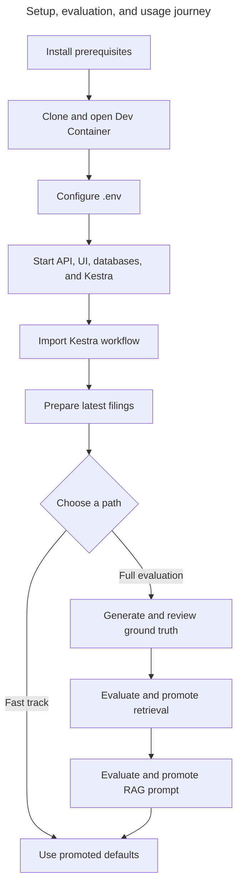

# Getting started: set up, evaluate, and use the system

This guide is the complete path from a fresh clone to a usable SEC filing research system. The
fast track uses the checked-in retrieval and generation defaults. The full evaluation path
reproduces the quality-selection process against corpora created in your own database.
Use the [command reference](commands.md) to look up project CLIs and frontend scripts without
leaving this journey.



## 1. Prerequisites

Install:

- Git;
- Visual Studio Code with the Dev Containers extension;
- Docker Desktop, or another Docker environment compatible with Dev Containers;
- a Google OAuth web client for local sign-in;
- an OpenAI account and API key with an approved spending limit;
- a truthful SEC product/contact identity.

Register `http://localhost:5173/api/auth/google/callback` as an exact authorized redirect URI in
the Google OAuth web client. Corpus preparation, embeddings, ground-truth generation, answer
generation, and judging use external services and may incur cost.

## 2. Clone and open the development environment

Clone `https://github.com/hongchit/sec-filing-rag-poc.git` with Git or VS Code, open the repository,
and select **Dev Containers: Reopen in Container**. The first creation installs pinned Python and
frontend dependencies. The container starts isolated application and Kestra PostgreSQL services;
the post-start hook waits for the application database and applies migrations.

## 3. Configure the environment

From the repository root:

```bash
# Create the untracked local environment file from the documented template.
cp .env.example .env
```

Replace every placeholder in `.env`. At minimum, verify:

- `EDGAR_IDENTITY` truthfully identifies the application and contact;
- `OPENAI_API_KEY`, active models, and `config/model-pricing-v1.json` agree;
- `GOOGLE_CLIENT_ID`, `GOOGLE_CLIENT_SECRET`, `GOOGLE_ADMIN_EMAILS`, and `PUBLIC_BASE_URL` match
  the local OAuth client;
- `SESSION_SECRET` and `INGESTION_API_TOKEN` meet their documented minimum lengths;
- PostgreSQL and Kestra credentials match the container configuration;
- `SECRET_INGESTION_API_TOKEN` is the base64 encoding of the exact raw
  `INGESTION_API_TOKEN`, without a newline.

[Configuration](configuration.md) defines every variable and compatibility-sensitive setting.
Never commit `.env` or paste its contents into issue reports or external tools.

## 4. Start the application and import the workflow

Open separate Dev Container terminals:

```bash
# Apply migrations safely and start the FastAPI backend on port 8000.
uv run sec-rag-migrate
uv run sec-rag-api
```

```bash
# Start the React development server on port 5173.
npm --prefix frontend run dev
```

Open the Kestra UI at <http://127.0.0.1:18082>, sign in with the configured Kestra credentials, and
import `workflows/filing_batch.yaml`. Confirm namespace `sec_filings.ingestion` and flow ID
`filing_batch`. Then check <http://127.0.0.1:8000/api/health> and open
<http://127.0.0.1:5173>.

## 5. Sign in and prepare the first corpora

Select **Sign in with Google**. On a fresh database, the Research page explains that no searchable
corpus exists and offers **Prepare latest filings**. This submits one authenticated latest-mode
batch for all enabled companies. It can take several minutes and incurs embedding cost. The UI
retains the batch ID so polling can resume after a refresh or closed tab.

Wait for at least one company to have a ready active corpus. Inspect the Kestra execution for task
progress and use the Research or Corpus Reader company selectors to confirm readiness. Partial
failure preserves successful and previously ready corpora; correct the reported cause and submit a
new batch rather than editing lifecycle rows.

The generated [REST Client collection](../api/sec-filing-rag.http) is the executable API reference.
Browser sign-in is the primary setup path because public application mutations require a session
and CSRF token.

## 6. Fast track: use the checked-in defaults

Evaluation is not required before a first functional review. The repository already promotes a
measured retrieval default in `config/retrieval.json` and a guarded generation prompt in
`config/generation.json`.

Use the platform at:

- <http://127.0.0.1:5173/research> to select a company and filing, choose a goal, ask a question,
  and verify cited evidence;
- <http://127.0.0.1:5173/corpus> to browse complete filing Items and historical corpora;
- <http://127.0.0.1:5173/evaluation> to inspect the checked-in retrieval benchmark summary;
- `/research/history` to revisit stored work and `/admin` for authorized operational inspection.

The checked-in benchmark records its original corpus UUIDs. A newly ingested database has different
corpus-version UUIDs, so its case-level evidence cannot satisfy the checked-in database-lineage
check. Follow the full path to produce lineage-valid local evaluation artifacts.

## 7. Full path: prepare evaluation corpora and ground truth

Use **Prepare a filing for another year** on the Research page to add compatible historical 10-Ks
for AAPL, MSFT, and NVDA. Exact-year preparation remains historical and does not replace the latest
active corpus. Confirm model, pricing, budget, corpus compatibility, and expected call counts before
continuing.

The authoritative commands and human decisions are in
[Retrieval ground-truth preparation and review](../evaluation/REVIEW.md). Complete these stages in
order:

1. Generate `evaluation/ground-truth-review-v1.json` with model-assisted candidate questions.
2. Human-review every selected chunk and question; model output alone is not ground truth.
3. Validate all decisions and finalize the checksum-bound JSONL dataset and manifest.
4. Run retrieval preflight, inspect coverage warnings, and execute the controlled benchmark.

The [retrieval evaluation guide](retrieval-evaluation-workflow.md) explains the learning concepts,
metrics, fairness controls, and failure analysis behind those operational steps.

## 8. Promote an accepted retrieval result

Inspect `evaluation/results/retrieval-v1.json`. If its selected result is accepted after coverage,
miss, latency, and warning review, copy the `selected_default` strategy fields into the `default`
object in `config/retrieval.json`: `strategy`, `candidate_count`, `top_k`, `alpha`, and `rrf_k`.
Update `reason` with the artifact identity, metrics, and review rationale. Keep unused strategy
parameters at their configured stable values so the strict schema remains complete.

Run the normal verification set, restart FastAPI, and confirm startup accepts the tracked retrieval
configuration. Evaluation records a recommendation; it never edits runtime configuration.

## 9. Evaluate and promote the complete RAG path

Full-RAG evaluation must run after retrieval promotion because every prompt receives context from
the same promoted retrieval default. Start with
[Prompt roles in full-RAG evaluation](rag-evaluation-workflow.md#prompt-roles-in-full-rag-evaluation),
then preflight expected provider calls, run all configured prompt variations, validate the JSON
artifact, inspect deterministic citation checks, and human-calibrate a stratified sample of judge
verdicts.

If the selected prompt is accepted, set `promoted_prompt_id` in `config/generation.json` to that
eligible prompt ID and update `promotion_reason` with the artifact and human-review rationale. Do
not copy a winner from an incomplete prompt or a batch with invalid/cross-corpus citations. Run the
normal verification set and restart FastAPI. The evaluator preserves artifacts and selection
rationale but never changes the runtime prompt automatically.

## 10. Verify the completed system

Use [Testing](testing.md) for the complete provider-free verification command set. Then perform a
browser acceptance pass:

1. Ask a filing question and confirm the answer, limitations, and citation links.
2. Open cited evidence in the Corpus Reader and follow its EDGAR source link.
3. Inspect retrieval metrics and at least one case in the Evaluation dashboard.
4. Confirm research history is private to the signed-in user.
5. If authorized as an administrator, inspect model executions, usage, retries, and safe failures.

For ongoing monitoring, recovery, migrations, and reset procedures, continue with
[Operations](operations.md). For symptoms and remediation, use [Troubleshooting](troubleshooting.md).
