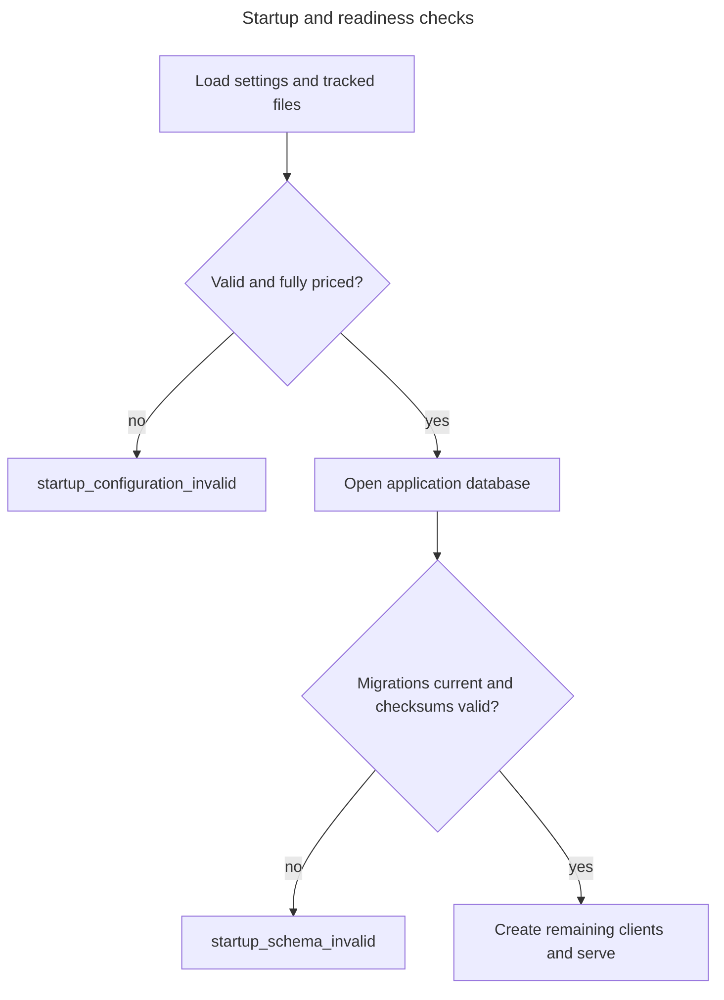

# Operations

Operations covers runtime readiness, observability, migrations, recovery, and destructive reset.
Initial setup and evaluation promotion belong to [Getting started](getting-started.md), setting
definitions to [Configuration](configuration.md), and symptom diagnosis to
[Troubleshooting](troubleshooting.md).

## Startup and readiness



Run migrations before the API:

```bash
# Apply pending schema changes before accepting traffic.
uv run sec-rag-migrate

# Start the API and then verify application/database readiness.
uv run sec-rag-api
curl --fail-with-body http://127.0.0.1:8000/api/health
```

Startup verifies essential settings, tracked runtime files, exact active-model pricing, database
connectivity, migration checksums, and required relations. SEC, OpenAI, and Kestra reachability remain
bounded runtime concerns.

## Observability

Supply `X-Request-ID: <safe-id>` to correlate an API call. FastAPI returns the accepted/generated ID
and emits structured logs. Batch responses also contain the Kestra execution ID.

Use each system for its authority:

- FastAPI logs: request validation, policy, provider translation, and safe failures;
- Kestra logs: task attempts, retry timing, and execution graph;
- application PostgreSQL: durable batch, item, ingestion, corpus, research, usage, and evaluation
  state;
- Kestra PostgreSQL: engine state only.

Events never include `.env` content, authorization headers, credential-bearing URLs, source HTML, or
provider payloads. Useful safe queries are collected in [Troubleshooting](troubleshooting.md).

## Routine filing operation

Submit latest intent, save `batch_id`, and poll until terminal:

```bash
# Submit latest-filing intent for all enabled companies.
curl --fail-with-body -i -X POST http://127.0.0.1:8000/api/filing-batches \
  -H 'Content-Type: application/json' -d '{}'

# Poll application-owned batch state until it is terminal.
curl --fail-with-body -i http://127.0.0.1:8000/api/filing-batches/$BATCH_ID
```

For exact-year processing, include `fiscal_year` and an optional ordered ticker subset. Exact-year
absence is a skip and never changes the active corpus. Resubmitting after a transient failure is
safe: acquisition and compatible corpus identities make retries idempotent, while the previous
ready/default corpus remains available.

## Migrations

Migrations are immutable and applied in filename order. The migrator records checksums in
`public.schema_migration`. A fresh database applies every numbered file; an existing database applies
only missing versions.

Running `uv run sec-rag-migrate` again is safe: applied files are verified by checksum and are not
executed twice. On a blank deployment database, apply migrations before starting the API, sign in as
the first configured administrator before enabling scheduled ingestion, and submit filing
preparation normally. Retrying ingestion against the same database is safe; compatible ready
corpora are reported as unchanged.

Checked-in evaluation artifacts provide aggregate orientation before the deployment has its own
audit rows and filing evidence. The API marks those resources unavailable rather than treating the
recorded benchmark as a deployment-native run. To replace it, ingest the intended current and
historical corpora, complete a new human review, run retrieval evaluation, and run generation
evaluation with unique output filenames. These evaluation commands make billable provider calls
and are not deployment bootstrap commands.

## Production evaluation release

Production stores one active evaluation release on a persistent volume. An idempotent init
container seeds the volume from checked-in image assets on first deployment. Operators create an
isolated working run, use the existing ground-truth and evaluation commands there, accept the
reviewed retrieval winner before full-RAG evaluation, and publish only after reviewing generation
results. Publication validates artifact and configuration identities before atomically replacing
the active release; it makes no provider calls or database writes.

Run only one operator evaluation at a time. It shares the deployed app container's CPU and memory
limits. A failed publication leaves the current active release unchanged, while a successful
publication removes it rather than retaining rollback history.

Never edit an applied migration. A checksum mismatch means the file must be restored. Add the next
numbered migration for a schema change, then test both a fresh application and an upgrade from the
current baseline.

## Failure and recovery principles

- Correct configuration/provider/infrastructure and submit new intent rather than manually editing
  lifecycle states.
- Preserve historical runs and safe errors for diagnosis.
- Trust application terminal states over Kestra presentation state.
- Let finalization close stranded items after interrupted workflow execution.
- Do not delete a prior ready corpus because a replacement failed.
- Validate checksums before reusing or moving evaluation artifacts.

These rules favor recoverability and audit over in-place repair.

## Reset only the application database (destructive)

The following reset permanently removes application PostgreSQL data while preserving Kestra history,
Codex state, Cargo tools, and shared caches. Stop the Dev Container first. From the repository root on
the host, identify the managed Compose project and exact application volume:

```bash
# Name the exact Compose project and application-data volume to inspect.
compose_project=sec-filing-rag-poc_devcontainer
app_db_volume="${compose_project}_postgres-data"

# Verify that both Compose labels identify only the application PostgreSQL volume.
docker volume inspect --format '{{ index .Labels "com.docker.compose.project" }}|{{ index .Labels "com.docker.compose.volume" }}' "$app_db_volume"
```

The output must be `sec-filing-rag-poc_devcontainer|postgres-data`. Stop if the volume is absent or
either label differs. Then stop the stack without deleting all volumes and remove only the verified
application volume:

```bash
# Stop the verified project without deleting all project volumes.
docker compose --project-name "$compose_project" -f .devcontainer/docker-compose.yml down

# Permanently remove only the previously verified application-data volume.
docker volume rm "$app_db_volume"
```

Do not use `down --volumes`; it removes unrelated persistent project state. Reopen the Dev Container
to recreate application PostgreSQL and apply migrations. The deleted volume is unrecoverable without
a separate backup.

## Generated artifacts

Public contract changes require regenerated and reviewed API artifacts:

```bash
# Regenerate both public contract artifacts after a route/schema change.
uv run sec-rag-export-openapi
uv run sec-rag-generate-http

# Fail if the checked-in artifacts are stale.
uv run sec-rag-export-openapi --check
uv run sec-rag-generate-http --check
```

Retrieval artifacts have a checksum-bound set and must be validated together. The complete benchmark
workflow lives in [evaluation/REVIEW.md](../evaluation/REVIEW.md).

## Operational acceptance

Before handoff:

1. Run the complete verification set in [Testing](testing.md).
2. With approved credentials, submit one latest and one exact-year batch.
3. Confirm all items terminate and every ready corpus has six coverage rows.
4. Confirm present chunk/search-document counts match.
5. Confirm the exact-year corpus is historical and did not replace the active corpus.
6. Open research, evaluation, and corpus-reader routes and verify their source links.
