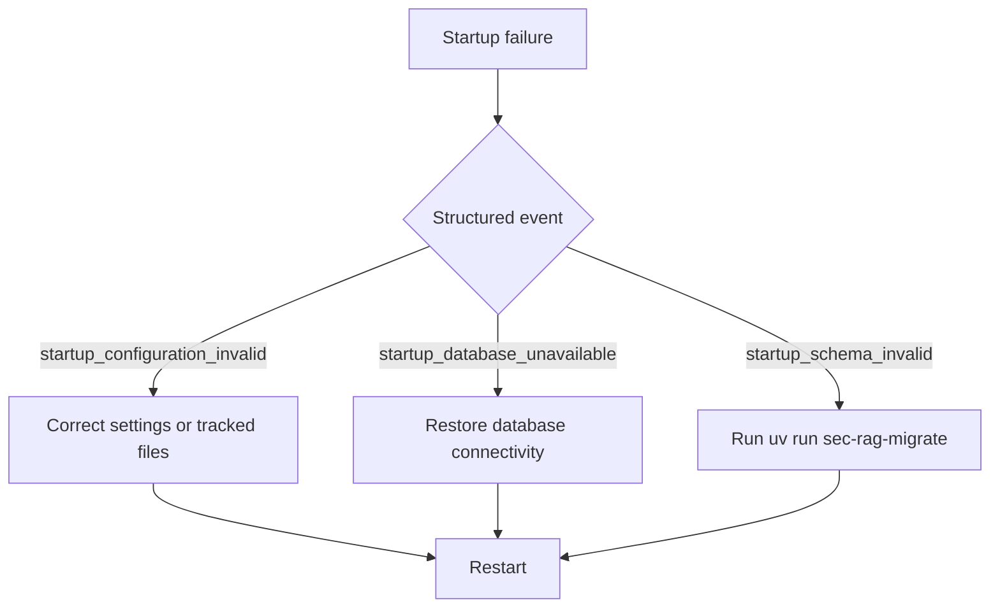

# Operations

## Startup validation and recovery



| Category | Rule | Stable code | Secret | Safe remediation |
|---|---|---|---|---|
| Credentials | present, non-placeholder | `placeholder_value` | yes | replace the named environment setting |
| Companies | valid file and enabled unique ticker | `no_enabled_companies` | no | enable a ticker |
| Retrieval | default selected; model/dimensions match | `embedding_configuration_mismatch` | no | align tracked/runtime settings |
| Generation | promoted/referenced prompts readable | `prompt_file_invalid` | no | restore the prompt file |
| Pricing | USD/1M and exact active-model coverage | `generation_price_missing` | no | add required rates and restart |
| Database | reachable within startup timeout | `startup_database_unavailable` | URL is secret | restore connectivity |
| Schema | all migrations and checksums current | `startup_schema_invalid` | no | run `uv run sec-rag-migrate` |

Events never include supplied values, credential-bearing URLs, `.env` content, or provider/private data.
Third-party OpenAI, SEC, and Kestra reachability is a bounded runtime concern, not a startup gate.

Pricing lives in `config/model-pricing-v1.json` as USD per 1,000,000 tokens. Embeddings require input
pricing; generation requires input and output pricing. Restart after changes; historical requests retain
their snapshot. The decimal estimate includes every attempt and retry. It is unavailable for legacy
requests or if any chargeable provider operation lacks usage. Zero reported tokens are valid. Budgets,
quotas, discounts, billing reconciliation, and invoice matching remain excluded.

## Setup, configuration, and ports

Open the repository in its Dev Container. The create hook installs locked Python dependencies, `httpgenerator` 1.1.0, frontend dependencies, and Codex. Copy `.env.example` to `.env`; do not commit it. Variables fall into SEC identity/rate and input bounds, OpenAI model/key, application/runtime/chunking, application PostgreSQL/pool, Kestra client/basic auth, and the base64 Kestra secret containing the same raw internal bearer token.

Local ports are FastAPI 8000, Vite 5173, application PostgreSQL 5432, Kestra UI/API 18082, and Kestra management 18083. The two PostgreSQL services share initialization credentials but separate volumes and responsibilities.

## Initialize and start

The post-start hook waits for PostgreSQL and runs `uv run sec-rag-migrate`. It is safe to run the migration command again. Start the API with `uv run sec-rag-api`, and optionally the shell with `npm --prefix frontend run dev`. Import/re-import `workflows/filing_batch.yaml` in Kestra; its namespace is `sec_filings.ingestion` and ID is `filing_batch`.

```bash
curl --fail-with-body -i http://127.0.0.1:8000/api/health
curl --fail-with-body -i http://127.0.0.1:8000/api/companies
curl --fail-with-body -i http://127.0.0.1:18082/api/v1/main/configs
```

Submit and poll using the examples in the README. Include `X-Request-ID: <safe-id>` when diagnosing a request; FastAPI returns the accepted/generated ID and emits structured logs with it. Batch responses contain the Kestra execution ID. Application logs explain API/policy failures; Kestra logs show task attempts; `filing_batch`, `filing_batch_item`, `ingestion_run`, and `ingestion_stage` show durable state.

## Failure and recovery

Kestra retries selection/acquisition/processing calls and the failure/finalization callbacks three times. A failed item is terminal and later items continue. `finally` always calls finalization, which converts stranded states to failed and calculates the aggregate. Safe retries reuse acquisitions by company/accession/checksum and corpora by filing/compatibility key. Resubmit a batch after correcting provider, credentials, or infrastructure; prior successful/default data remains intact. Do not manually edit states unless investigating with a disposable database.

Useful inspection:

```bash
psql "$DATABASE_URL" -c "select id,mode,fiscal_year,status,kestra_execution_id,safe_error from public.filing_batch order by created_at desc"
psql "$DATABASE_URL" -c "select batch_id,position,status,selected_accession,acquisition_id,corpus_version_id,safe_error from public.filing_batch_item order by batch_id,position"
psql "$DATABASE_URL" -c "select id,trigger,status,stage,section_count,chunk_count,safe_error from public.ingestion_run order by created_at desc"
psql "$DATABASE_URL" -c "select ticker,accession,item,coverage_status,chunk_count,search_document_count from gold.corpus_status order by ticker,item"
```

## Reset only the application database (destructive)

Apply migrations with `uv run sec-rag-migrate`. Never edit an applied numbered migration; add the
next migration instead. A checksum mismatch means an immutable migration changed after application
and must be restored, not that migration history should be edited manually.

The reset below permanently deletes application PostgreSQL data. It preserves Kestra history and storage, Codex state, Cargo tools, and shared caches. Stop the Dev Container first. From the repository root on the host, verify the managed Compose project and exact application volume before removing anything:

```bash
compose_project=sec-filing-rag-poc_devcontainer
app_db_volume="${compose_project}_postgres-data"
docker volume inspect --format '{{ index .Labels "com.docker.compose.project" }}|{{ index .Labels "com.docker.compose.volume" }}' "$app_db_volume"
```

The inspection must print `sec-filing-rag-poc_devcontainer|postgres-data`. Stop if the volume is absent or either label differs. Then stop the stack without deleting its volumes and remove only the verified application volume:

```bash
docker compose --project-name "$compose_project" -f .devcontainer/docker-compose.yml down
docker volume rm "$app_db_volume"
```

Do not use `down --volumes`; it removes unrelated persistent project state. Reopen the Dev Container so PostgreSQL recreates the application volume and the post-start hook applies the current schema. Kestra data was retained, so its flow does not need to be re-imported unless the workflow definition changed independently. The removed application volume is not recoverable unless separately backed up.

## Artifacts, verification, and acceptance

Regenerate/check OpenAPI and REST Client files with `sec-rag-export-openapi` and `sec-rag-generate-http`. Use the README's **Formatting and linting** section for the canonical fix and non-mutating verification commands, then run its full verification command set. Live acceptance requires working SEC/OpenAI/Kestra credentials: submit one latest batch and one exact-year batch, poll both terminal, confirm six coverage rows and matching present chunk/search counts, then confirm the exact-year corpus is listed as historical and did not change `active_corpus`. Live SEC tests are opt-in (`pytest -m live_edgar`).

## Generation evaluation and promotion

Generation evaluation uses the 96 reviewed baseline cases with two prompts. This incurs meaningful
OpenAI cost: confirm models, account limits, and the full workload before a live run. Never place
keys, private filing data, or provider payloads in artifacts or logs.

The tracked generation contract is `config/generation.json`; templates live under `prompts/`. Validate a completed artifact and render its summary with:

```bash
sec-rag-evaluate-generation evaluation/results/generation-v1.json --markdown evaluation/results/generation-v1.md
```

The validator requires 96 cases and rejects a selected prompt that failed the 100% valid-handle or
zero-cross-corpus guardrails. Refusal-aware prompt/configuration versions must be benchmarked as new
artifacts; promote only the measured eligible winner and update hashes, documentation, and runtime
default together.
