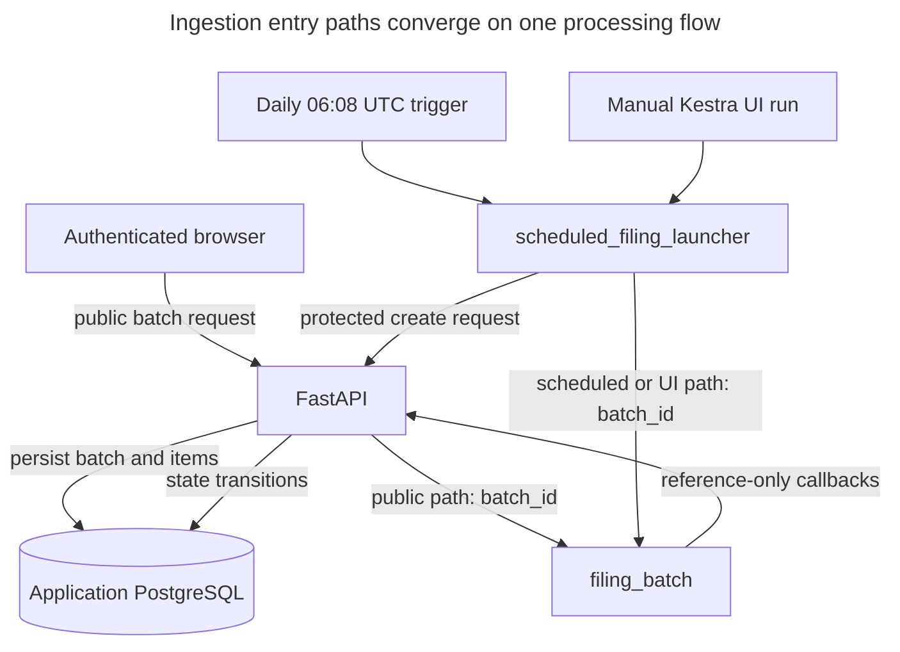
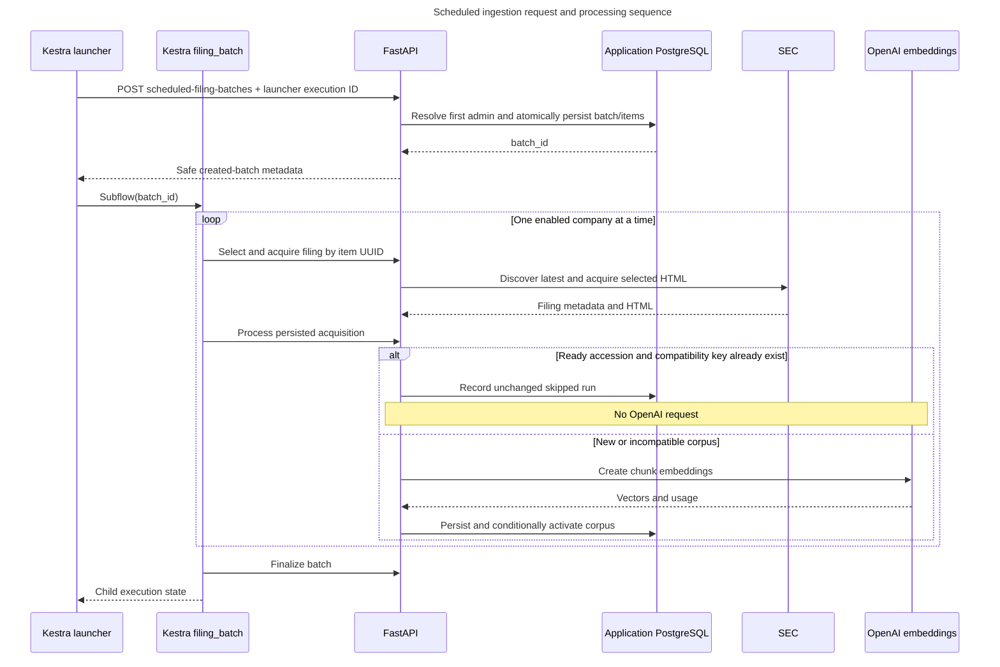
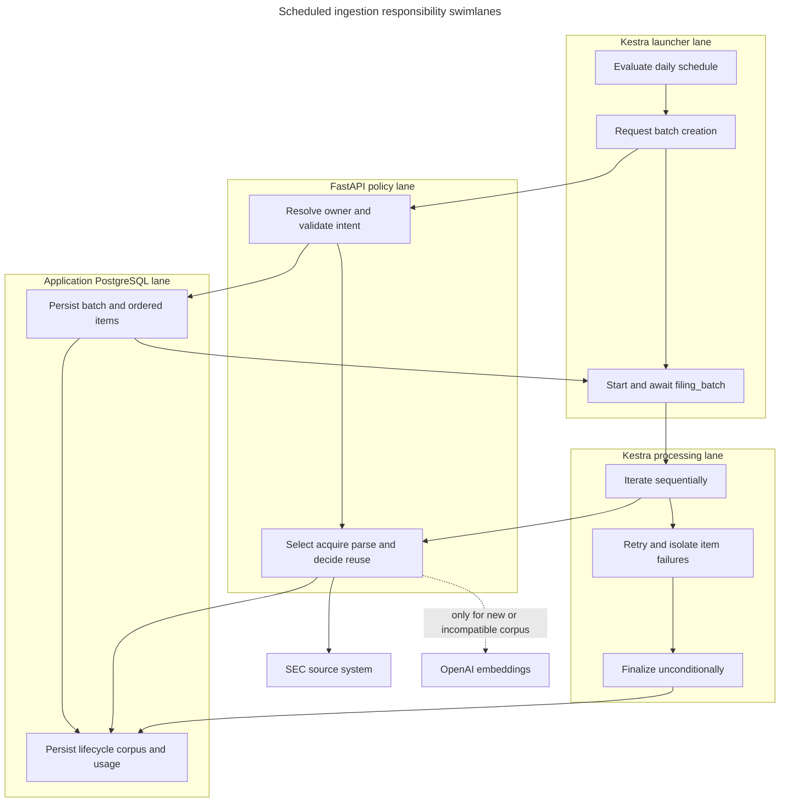
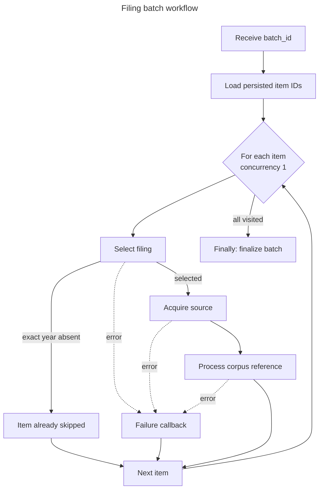
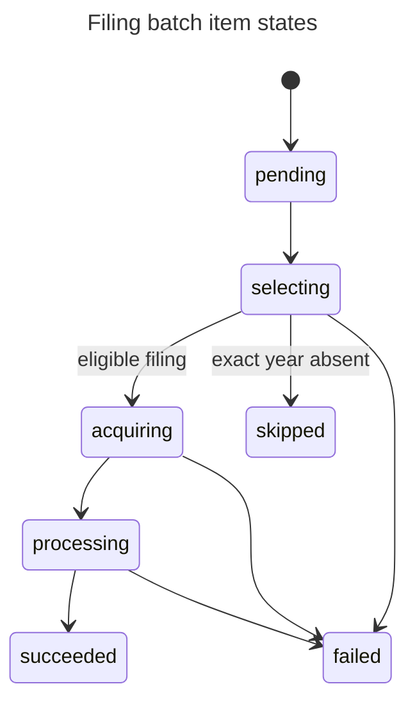
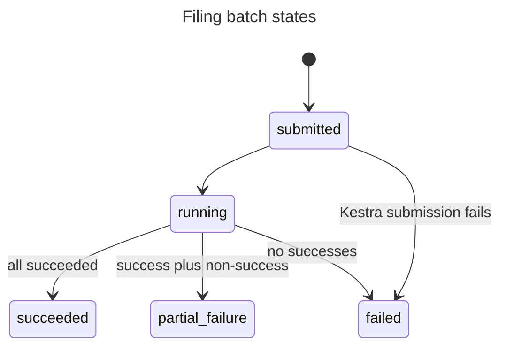

# Orchestration

Kestra coordinates ingestion but does not own filing policy or corpus state. Public requests ask
FastAPI to persist and submit a batch. Scheduled and Kestra-UI requests use
`scheduled_filing_launcher`, which asks FastAPI to persist the batch and then invokes the same
`sec_filings.ingestion.filing_batch` processing flow. Every callback reloads authoritative state by
UUID.

## Component boundary

This reference-only boundary keeps filing bytes, provider objects, model payloads, and business
credentials out of workflow transport. Kestra supplies scheduling, retries, sequential iteration,
execution history, local error handling, and unconditional finalization. Python supplies selection,
validation, idempotency, persistence, activation, and failure policy.

## Scheduled launcher sequence

The launcher definition is `workflows/scheduled_filing_launcher.yaml`. Its schedule uses
`8 6 * * *` in `Etc/UTC`, recovers only the last missed run, and disallows overlapping scheduled
executions. Optional launcher inputs support an ordered ticker subset or exact fiscal year for a
manual Kestra-UI execution; the daily trigger omits both to request every enabled company's latest
original 10-K.

FastAPI attributes scheduled preparation cost to the first address in `GOOGLE_ADMIN_EMAILS`. That
administrator must have signed in once and remain active; otherwise batch creation fails before
reserving cost or writing a batch.

## Flow graph

The flow definition is `workflows/filing_batch.yaml`. `ForEach` uses `concurrencyLimit: 1` to make
SEC access and state transitions easy to inspect. Local errors call the item-failure endpoint with
`allowFailure: true`, so later companies continue. The flow-level `finally` callback runs regardless
of earlier task outcomes.

## State machines

Items normally move `pending → selecting → acquiring → processing → succeeded`. `skipped` and
`failed` are terminal. Each transition records references, timestamps, execution correlation, and a
bounded safe error where applicable.

Finalization marks stranded non-terminal items failed before calculating the aggregate. In latest
mode, an unchanged compatible corpus is a healthy completion: all-unchanged and mixed
new-plus-unchanged batches end `succeeded` unless an item failed. In exact-year mode, skipped items
still mean the requested filing was absent and do not count as success.

## Retry and idempotency

Selection, acquisition, processing, failure, and finalization are designed for safe repetition.
Kestra applies constant retry to callback tasks. Application safeguards include:

- terminal filing selection is reused;
- a unique launcher execution ID returns the already-created batch after an HTTP retry;
- an acquisition is identified by company, accession, and checksum;
- a corpus is identified by filing plus compatibility key;
- ready compatible corpora are reused rather than re-embedded;
- failure and finalization callbacks tolerate already-terminal state;
- candidate persistence and active-pointer changes are transactional.

Latest processing can promote a compatible ready historical corpus. Exact-year processing never
promotes. The detailed source and activation logic belongs to [Pipeline](pipeline.md).

## Authentication and failures

FastAPI authenticates to Kestra with Basic authentication. Kestra resolves the base64-encoded
internal bearer token from its secret environment and uses it for callbacks. Error messages never
include either credential.

If submission fails, FastAPI marks pending items failed because no workflow can visit them. If an
individual task exhausts retries, its local callback terminates only that item. Finalization is the
last safety net for interrupted executions. Operators diagnose application policy in FastAPI logs,
task attempts in Kestra, and durable outcomes in application tables; see
[Troubleshooting](troubleshooting.md).

For the scheduled path, failure to create a batch leaves no application work. If batch creation
succeeds but the processing subflow cannot start after retries, the launch-failure callback marks
the batch and pending items failed and reconciles the unused reservation.

