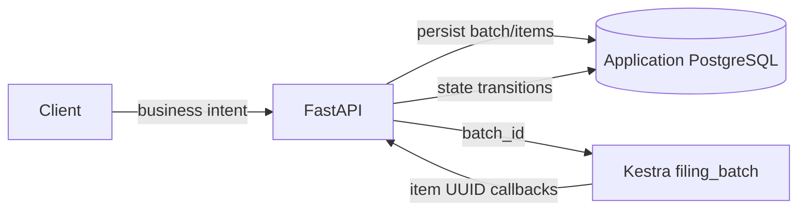
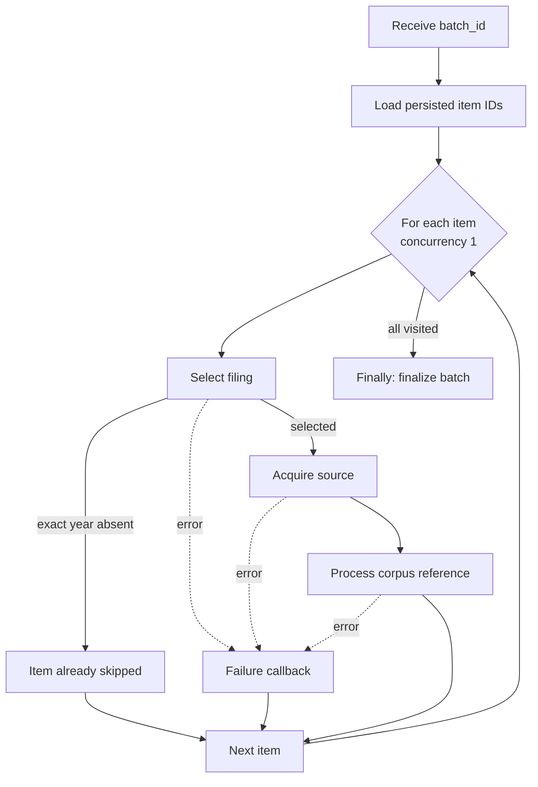
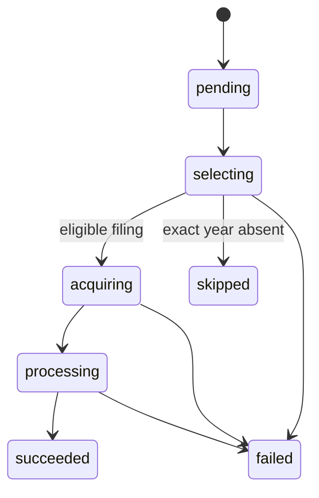
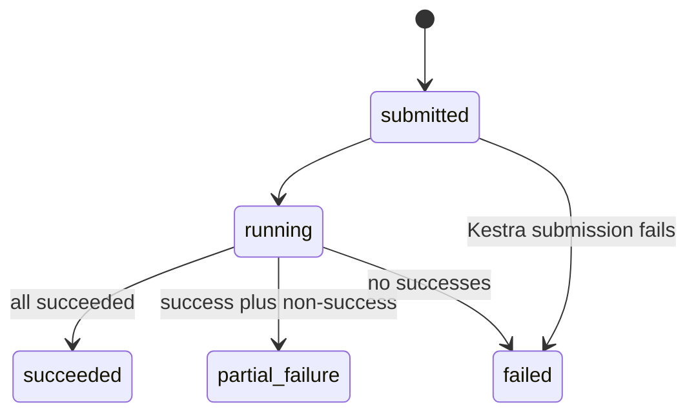

# Orchestration

Kestra coordinates the ingestion batch but does not own filing policy or corpus state. FastAPI first
persists a batch and its ordered items, then submits only `batch_id` to the single
`sec_filings.ingestion.filing_batch` flow. Every callback reloads authoritative state by UUID.

## Component boundary

This reference-only boundary keeps filing bytes, provider objects, model payloads, and business
credentials out of workflow transport. Kestra supplies scheduling, retries, sequential iteration,
execution history, local error handling, and unconditional finalization. Python supplies selection,
validation, idempotency, persistence, activation, and failure policy.

## Flow graph

The flow definition is `workflows/filing_batch.yaml`. `ForEach` uses `concurrencyLimit: 1` to make
SEC access and state transitions easy to inspect. Local errors call the item-failure endpoint with
`allowFailure: true`, so later companies continue. The flow-level `finally` callback runs regardless
of earlier task outcomes.

## State machines

Items normally move `pending → selecting → acquiring → processing → succeeded`. `skipped` and
`failed` are terminal. Each transition records references, timestamps, execution correlation, and a
bounded safe error where applicable.

Finalization marks stranded non-terminal items failed before calculating the aggregate. An all-skip
batch has zero successes and therefore ends `failed`; the item reasons still distinguish an expected
exact-year miss from an operational error.

## Retry and idempotency

Selection, acquisition, processing, failure, and finalization are designed for safe repetition.
Kestra applies constant retry to callback tasks. Application safeguards include:

- terminal filing selection is reused;
- an acquisition is identified by company, accession, and checksum;
- a corpus is identified by filing plus compatibility key;
- ready compatible corpora are reused rather than re-embedded;
- failure and finalization callbacks tolerate already-terminal state;
- candidate persistence and active-pointer changes are transactional.

Latest processing can promote a compatible ready historical corpus. Exact-year processing never
promotes. The detailed source and activation logic belongs to [Pipeline](pipeline.md).

## Authentication and failures

FastAPI authenticates to Kestra with Basic authentication. Kestra resolves the base64-encoded
internal bearer token from its secret environment and uses it for callbacks. Error messages never
include either credential.

If submission fails, FastAPI marks pending items failed because no workflow can visit them. If an
individual task exhausts retries, its local callback terminates only that item. Finalization is the
last safety net for interrupted executions. Operators diagnose application policy in FastAPI logs,
task attempts in Kestra, and durable outcomes in application tables; see
[Troubleshooting](troubleshooting.md).

