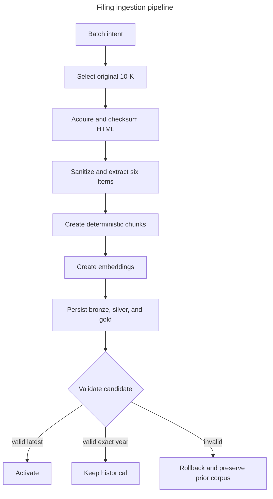
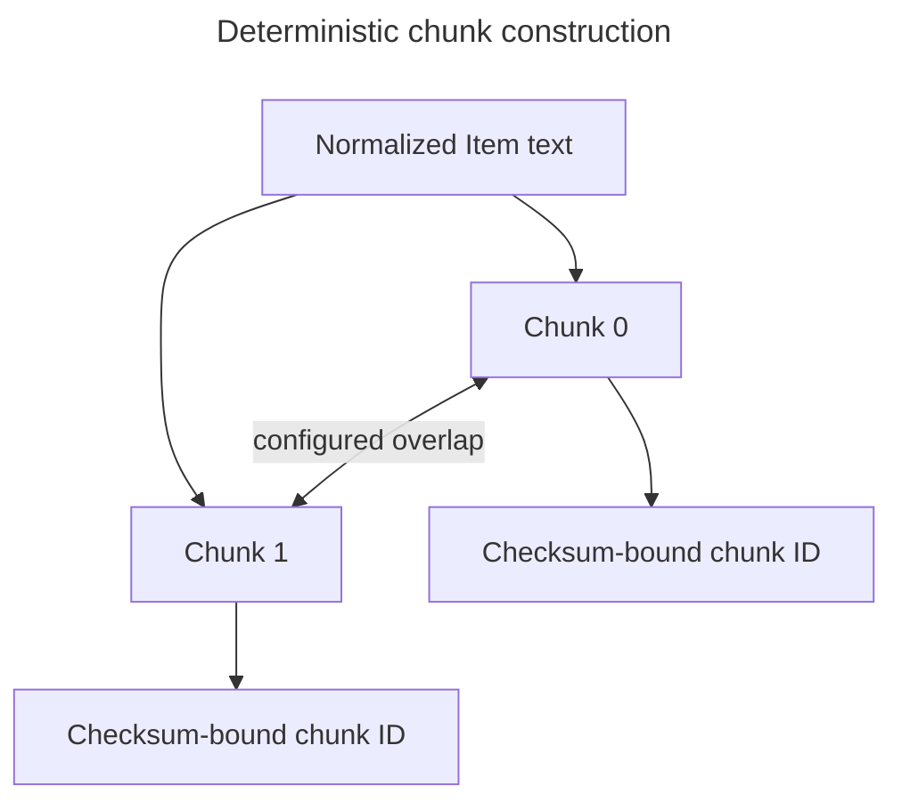
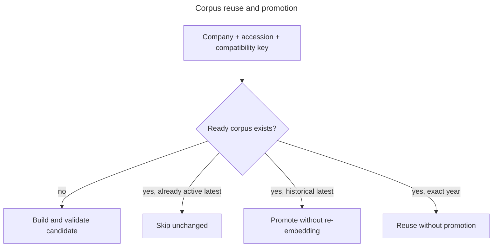

# Pipeline

The corpus pipeline converts original SEC filings into a versioned, validated retrieval corpus. Its
business purpose is not merely to download documents: it creates governed knowledge that can be
searched, evaluated, cited, replaced safely, and reproduced later.

## Responsibilities and boundaries

The pipeline owns filing selection, source acquisition, sanitization, Item extraction, deterministic
chunking, embeddings, lineage, validation, and activation. It does not answer research questions or
choose a retrieval strategy. [Research](research.md) consumes a ready corpus, while
[Evaluation](evaluation.md) measures retrieval behavior.

## Selection and preparation intent

A public request loads `config/companies.yaml`, records its normalized configuration checksum, and
atomically creates one `filing_batch` with ordered `filing_batch_item` rows.

- **Latest mode** selects the maximum original 10-K by report date, filing date, and accession.
- **Exact-year mode** matches only `report_date.year`; absence records a safe `skipped` item.
- Forms must equal `10-K`; amendments such as `10-K/A` are excluded.
- An exact-year miss never substitutes an adjacent year, because silent substitution would corrupt
  period-specific research and evaluation.

Kestra sequences the persisted work as described in [Orchestration](orchestration.md).

## Source acquisition

EdgarTools resolves the configured ticker, rediscovers the selected accession, and supplies filing
metadata and the original filing HTML. Resolution fails closed when it produces zero or multiple
distinct CIK values. Required accession, dates, primary-document identity, and URLs must be present.
Missing, non-HTML, oversized, or inconsistent documents fail before corpus construction.

The exact UTF-8 bytes, byte length, SHA-256 checksum, primitive provider metadata, company, and
accession are written to the bronze acquisition handoff. Processing reloads that persisted record
and rechecks media type and checksum. Provider objects do not cross process or workflow boundaries.

## Sanitization and Item extraction

BeautifulSoup removes script, style, active containers, hidden elements, comments, controls, and
bidirectional formatting characters. Unicode text is normalized with NFKC, and configured document
and narrative limits prevent unexpectedly large inputs from exhausting local resources. Offsets are
calculated only after normalization, establishing one coordinate system for sections and chunks.

The parser extracts exactly these Form 10-K Items:

| Item | Content |
| --- | --- |
| 1 | Business |
| 1A | Risk Factors |
| 3 | Legal Proceedings |
| 7 | Management's Discussion and Analysis |
| 7A | Quantitative and Qualitative Disclosures About Market Risk |
| 8 | Financial Statements and Supplementary Data |

Each Item becomes `present`, `legitimately_absent`, `failed`, or `not_assessed`. Legitimate absence
requires a bounded reason. Failed or not-assessed coverage prevents candidate persistence and
activation. This distinction keeps a valid cross-reference or omitted disclosure from being treated
like a parser defect.

Filing HTML is not uniform. Regression fixtures cover fragmented headings, short bounded Item 3
cross-references, ambiguous boundaries that must fail closed, active/hidden content removal, and
large original documents. Table-heavy Items remain normalized plain text; reconstruction is outside
the POC boundary.

## Deterministic chunking

A chunk is a bounded, overlapping character segment from one present Item. `CHUNK_SIZE_CHARS` limits
its maximum input context, while `CHUNK_OVERLAP_CHARS` carries boundary context into the neighboring
chunk. The overlap improves retrieval around arbitrary cuts at the cost of repeated text and some
index growth.

Chunk identity hashes the accession, Item, ordinal, compatibility/chunking version, source offsets,
and text checksum. The same source and configuration therefore produce the same identifiers;
changing relevant text or processing settings produces a new identity rather than mutating old
evidence.

## Embeddings and search records

An embedding is a numeric vector representing semantic meaning. OpenAI receives chunk text and
returns one vector per chunk. The pipeline validates vector count and dimensions before persistence.
`llm_usage` records model, token availability, latency, retries, and normalized outcome.

Gold search documents repeat chunk text, citation, filter keys, embedding, lexical representation,
and provenance. PostgreSQL supports:

- BM25 lexical retrieval for exact terms and filing language;
- vector similarity for semantic paraphrases;
- weighted hybrid and reciprocal-rank fusion in the retrieval service.

Strategy selection is evidence-based and belongs to [Evaluation](evaluation.md).

## Compatibility and reuse

The compatibility key binds source checksum, parser version, chunking version, embedding model and
dimensions, and index version. It prevents a corpus built under one processing contract from being
silently treated as equivalent to another.

Reuse avoids repeated provider cost. After SEC discovery and acquisition reproduce the same
accession, source checksum, and compatibility key, the pipeline returns before accessing OpenAI;
there is no embedding or generation request for that company. Latest mode promotes a compatible
ready historical corpus when needed. Exact-year mode records a skipped/reused run and never changes
the active pointer.

## Transactional persistence and activation

One transaction writes or links:

1. immutable bronze company, filing, and document snapshots;
2. silver filing identity and corpus version;
3. six section coverage rows and their chunks;
4. one gold search document per chunk;
5. final ready state and, for latest mode, the default activation.

Candidate validation requires exactly six coverage rows, no unusable coverage, chunks for every
present section, no chunks plus a reason for absent sections, matching silver/gold text and counts,
the configured embedding contract, required provenance keys, and consistent offsets and citations.
Failure rolls back candidate work and preserves the previous ready/default corpus.

## Lineage and provenance

Provenance records ticker, CIK, accession, Item, primary document and source URL, source checksum,
bronze snapshot/document identifiers, EdgarTools version, offsets, anchor, and ordinal. This lineage
supports citation hydration, evaluation reproducibility, historical research, and direct corpus
inspection without relying on the model's output.

The database constraints behind retry safety are documented in
[Database schema](database-schema.md). Durable activation policy is captured in
[ADR 0002](decisions/0002-versioned-corpus-activation.md).

## Failure behavior and observability

Each company is isolated inside the batch. A source, parser, embedding, or persistence failure
records a bounded terminal item/run/stage error and does not prevent later companies from running.
Counts and timestamps expose progress without querying Kestra. Provider details and filing bodies do
not appear in safe errors.

See [Operations](operations.md) for runtime inspection and [Troubleshooting](troubleshooting.md) for
symptom-based recovery.
