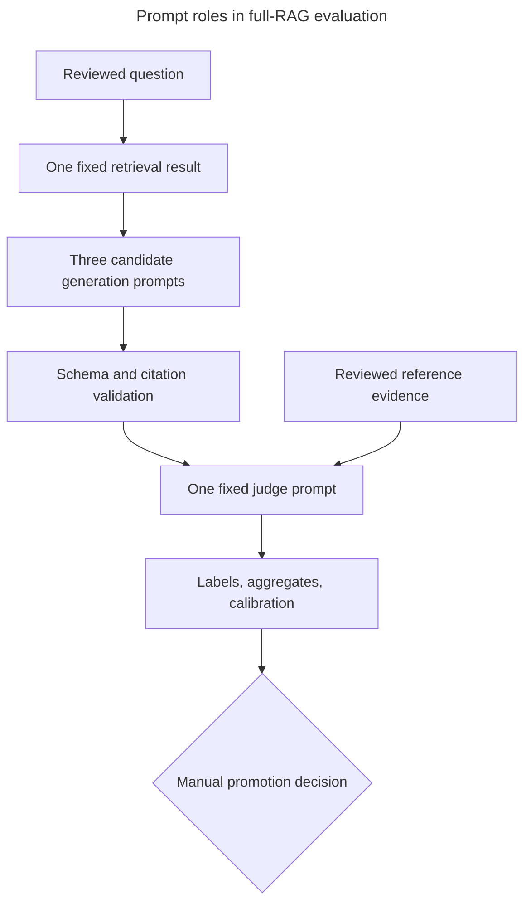

# Full-RAG evaluation guide

Full-RAG evaluation asks whether the complete retrieval, prompt, and generation path produces a
responsive, supported answer. This guide adapts the course's [RAG-answer](https://github.com/DataTalksClub/llm-zoomcamp/blob/main/04-evaluation/lessons/12-rag-answers.md) and [LLM-as-a-judge lessons](https://github.com/DataTalksClub/llm-zoomcamp/blob/main/04-evaluation/lessons/13-llm-as-judge.md)
and [Module 7 project example](https://github.com/DataTalksClub/llm-zoomcamp/blob/main/07-project-example/lessons/03-evaluating-rag.md) from [DataTalksClub LLM-Zoomcamp](https://github.com/DataTalksClub/llm-zoomcamp).
It follows retrieval promotion in the complete
[setup, evaluation, and usage journey](getting-started.md).

## The adapted A → Q → A′ model

- `A` is the set of human-reviewed relevant filing chunks used as reference evidence.
- `Q` is the reviewed investor question.
- `A′` is the structured answer from the complete production retrieval/prompt/generation path.

Unlike a textbook ideal-answer dataset, `A` is not an exhaustive best answer. It establishes
reliable supporting evidence. Another filing chunk could support a valid answer, so the judge rubric
tests responsiveness, correctness, and support without claiming the reviewed chunks enumerate every
acceptable fact.

## Prompt roles in full-RAG evaluation

The two prompt groups have different jobs. The three templates under `config/prompts/` are candidate
runtime behaviors: each receives the same research goal, question, and retrieved evidence and
produces a structured answer. `evaluation/prompts/rag-judge-v1.txt` is a measurement instrument: it
receives a candidate answer plus human-reviewed reference evidence and assigns a relevance label. It
does not generate user-facing research. The earlier
[ground-truth question-generation prompt](retrieval-evaluation-workflow.md#ground-truth-question-generation-prompt)
creates candidate questions before human review and does not participate in answer generation or
judging.



### Three candidate answer prompts

The comparison preserves earlier prompt variants intentionally. It tests whether extra role,
structure, refusal, and classification instructions improve grounded answers or instead add enough
instruction burden to reduce responsiveness.

| Prompt | Characteristics and purpose | Strengths | Weaknesses and considerations |
| --- | --- | --- | --- |
| `basic-grounded-v1` | Minimal baseline requiring supplied evidence, exact handles, limitations, and no investment advice. | Short, direct, and useful for measuring the value of later instructions. | A prose prohibition does not explicitly map advice requests to the structured refusal field. |
| `basic-grounded-v2` | Adds explicit `policy_refusal` handling and separates policy refusal from insufficient evidence. | Keeps the compact baseline while making advice handling machine-readable and allowing supported filing facts. | Its mixed refusal-plus-facts instruction can conflict with the application model that normalizes rejected dispositions to no answer content. |
| `guardrailed-10k-v3` | Classifies answered, investment-advice, and out-of-scope requests in one structured response with detailed 10-K boundaries. | Most explicit scope taxonomy and closest prompt-level match to the application-owned disposition contract. | The long exclusion list increases prompt complexity and may reject useful borderline filing questions or distract from synthesis. |

Together, basic v1 supplies a minimal baseline, basic v2 isolates explicit refusal-state
instructions, and v3 tests a stricter classification approach. This is a purposeful controlled
set, not three claims about universally best wording. A prompt can be stronger for policy
classification yet weaker for answer completeness, so results must be inspected by case and
disposition as well as by aggregate score.

The checked-in `generation-v1` artifact remains the historical five-prompt run. It found
`structured-investor-v1` and `basic-grounded-v2` tied at a mean label score of about `1.990` with 95
of 96 answers labeled `RELEVANT`; `basic-grounded-v2` won the documented latency tie-break.
`structured-investor-v1` produced the same labels as basic v2 at higher recorded cost, while
`structured-investor-v2` was weakest at 90 relevant answers. Their source files are no longer part
of the active configuration, and the retained prompts now explicitly reserve citation handles for
the structured citations field. Source drill-down for the historical candidates therefore remains
unavailable until a new three-prompt evaluation records the current prompt checksums.
The three active candidates reduce the recorded generation-and-judge cost from about `$2.20` to
`$1.26` for 96 cases, excluding the shared retrieval cost. Results remain specific to the recorded
dataset, retrieval configuration, models, judge, and pricing snapshot.

### Judge prompt and score interpretation

`evaluation/prompts/rag-judge-v1.txt` asks a fixed judge model to compare the question and candidate
structured answer with reliable but non-exhaustive human-reviewed evidence. It returns
`RELEVANT`, `PARTLY_RELEVANT`, or `NON_RELEVANT` plus an explanation, measuring responsiveness,
correctness, and evidence support without requiring the answer to repeat one reference passage.

A fixed rubric makes many prompt outputs comparable and exposes omissions or unsupported synthesis
more consistently than ad hoc review. It remains an LLM judgment: labels are coarse, the judge may
favor a writing style, overlook a subtle error, or penalize a valid claim supported by other
retrieved filing evidence. Model or rubric changes also change the instrument. Deterministic schema,
citation-handle, and corpus checks therefore run separately, and humans calibrate a stratified
sample across prompts, labels, companies, goals, query types, and failures before promotion.

## Controlled batches

A comparison fixes the reviewed dataset, corpus snapshot, promoted retrieval configuration,
generation model, judge model, judge rubric, and prompt set. Retrieval occurs once per case and its
ranked context is reused for every prompt. This isolates the prompt variation instead of rewarding a
prompt that happened to receive different evidence.

Before live calls, preflight validates dataset and manifest checksums, database lineage, retrieval
and prompt compatibility, model pricing, judge placeholders, and unused output paths. It reports the
expected embedding, generation, and judge calls so cost can be reviewed. The default batch evaluates
all configured prompts; `--prompt-id` supports narrower diagnosis.

```bash
# Validate lineage and report workload without provider calls or artifact writes.
uv run sec-rag-run-generation-evaluation --output-json evaluation/results/generation-v1.json --output-markdown evaluation/results/generation-v1.md --validate-only

# Run one audited batch and preserve both machine-readable and reviewable artifacts.
uv run sec-rag-run-generation-evaluation --output-json evaluation/results/generation-v1.json --output-markdown evaluation/results/generation-v1.md

# Validate a completed artifact against an explicitly selected reviewed dataset and manifest.
uv run sec-rag-evaluate-generation evaluation/results/generation-v1.json --dataset evaluation/retrieval-v1.jsonl --manifest evaluation/retrieval-v1-manifest.json
```

Use new names such as `generation-v2.json` and `generation-v2.md` after editing prompts; existing
artifacts are never overwritten. Compare prompt variations within each batch. Hashes make lineage
and inputs reproducible, but provider output remains stochastic. Small score changes demand
case-level inspection, not automatic conclusions.

Live runs print flushed, line-oriented progress to `stderr` for preflight, retrieval, each
generation attempt, judging, case completion, winner selection, and artifact writing. The final
machine-readable JSON record remains alone on `stdout`, so redirect the streams independently when
needed. Pass `--no-progress` to suppress the progress stream; `--validate-only` always emits only
its concise workload JSON.

Terminal progress is an ephemeral operational view, not the audit record. Use the generation run
and `llm_usage` database rows for durable monitoring and reconciliation. A provider attempt appears
in `llm_usage` only after the provider call returns, so an in-flight wait can be visible in terminal
progress before it is visible in the database.

## Checks, judging, and selection

Each answer first passes deterministic schema, citation-handle, and corpus checks. The fixed judge
then returns `RELEVANT`, `PARTLY_RELEVANT`, or `NON_RELEVANT` with an explanation. Scores are 2, 1,
and 0. An incomplete prompt, failed case, invalid handle, cross-corpus citation, or missing judge
verdict makes that prompt ineligible. Eligible prompts are ordered by mean score, relevant count,
median generation latency, then stable prompt ID. The runner records its winner but never edits
`config/generation.json`; the promotion procedure below remains a manual review boundary.

Provider failures are bounded and preserved rather than erasing the batch. Audit rows own query
embedding, answer, retry, and judge usage; the artifact records hashes, pricing, timings, safe
errors, case lineage, aggregates, eligibility, and selection rationale.

## Human calibration and failure analysis

An LLM judge is a measurement instrument, not ground truth. Human-review a small stratified sample
across all labels, prompts, companies, goals, query types, and failures. Check whether explanations
apply the rubric consistently, and record disagreement before trusting aggregate movement.

Investigate failures by layer:

- Retrieval miss: the required evidence never reached the prompt; return to retrieval evaluation.
- Synthesis problem: evidence was present but the answer omitted, distorted, or overclaimed it.
- Invalid citation: a handle was invented, missing, or from another corpus.
- Judge disagreement: human review finds the verdict or rubric application unreliable.
- Provider failure: generation or judging was incomplete; the prompt is ineligible for that batch.

[Testing](testing.md) defines verification expectations. Promotion and rollback remain in
[this guide and Getting started](getting-started.md); Operations owns runtime maintenance.

## Promote an accepted prompt

The runner records a selection but never edits runtime configuration. Promote only after artifact
validation and stratified human calibration. Set `promoted_prompt_id` in `config/generation.json`
to the eligible `selected_prompt_id`, and update `promotion_reason` with the artifact identity and
human-review rationale. Do not promote a prompt with failed cases, incomplete judge results,
invalid citation handles, or cross-corpus citations.

Run the normal checks in [Testing](testing.md), restart FastAPI, and verify a research request uses
the promoted prompt. Preserve each JSON and Markdown evaluation artifact under its unique name so
the decision remains auditable.
