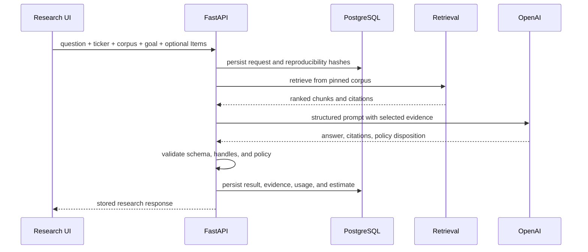
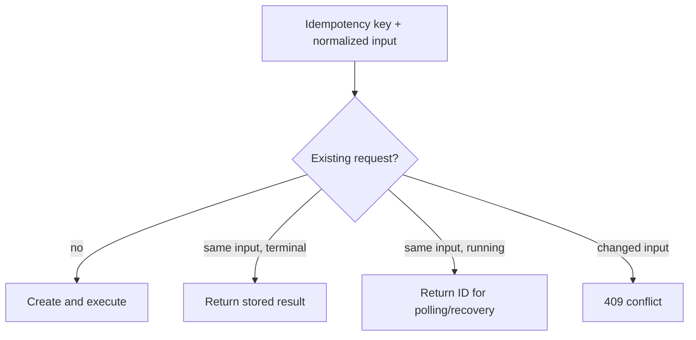

# Research

The research feature turns a filing question into a persisted, cited answer. It demonstrates the
second half of retrieval-augmented generation: measured retrieval supplies evidence, structured
generation synthesizes it, and application validation decides what can be exposed.

## User and business outcome

The `/research` workspace lets a user select a company, filing period, research goal, and optional
Item scope. The result separates filing facts from interpretation, links each substantive paragraph
to evidence, reports limitations, and keeps enough lineage to reproduce the request later.

This design supports faster review without treating generated prose as an authority. Source cards,
EDGAR links, and corpus-reader navigation keep verification one action away.

## Request lifecycle

The corpus UUID is mandatory. It prevents an answer from silently moving to a newer filing after
activation changes. Optional allowed Items narrow retrieval but cannot expand beyond the six
supported Items.

## Research goals

Goals provide intent-specific instructions without changing the source corpus:

- business;
- key risks;
- management analysis;
- market risk;
- legal and regulatory risk.

Goal labels guide retrieval and generation; they are not permissions or guarantees that evidence
exists. A valid in-scope question may still end with insufficient evidence.

## Retrieval and evidence

The service embeds the question, filters to the selected company/corpus/filing and optional Items,
then runs the promoted weighted-hybrid configuration. Candidate and top-k limits bound work. Each
retrieval result contains deterministic chunk identity, citation handle, text, score, source offsets,
accession, and EDGAR URL.

Research evidence stores ranked chunk lineage rather than a copied mutable source record. Reads join
the immutable silver relationships to hydrate full source data and `corpus_version_id`. This keeps
stored results aligned with the indexed corpus and supports direct context links.

## Structured generation and grounding

Generation receives the question, goal instructions, and selected evidence. The provider must return
the configured structured schema. Answer paragraphs are classified as filing facts or
interpretations and must carry one or more known citation handles.

Application validation rejects blank text, duplicate/unknown handles, malformed structure, and
substantive paragraphs without evidence. Grounding reduces unsupported claims and makes them easier
to detect; it does not prove every interpretation correct. Users should inspect the cited source for
material decisions.

## Policy and evidence states

The same structured generation call classifies the request as:

- `answered` for supported filing research;
- `investment_advice` for recommendations, trades, targets, timing, sizing, or predictions;
- `out_of_scope` for unsupported companies/forms/sources or unrelated professional advice.

Generated refusal prose is discarded. The application returns deterministic, application-owned
messages and suppresses public evidence for rejected requests. Policy refusal is independent of
`insufficient_evidence`: an allowed question can be in scope while the retrieved filing passages are
not enough for a complete answer.

## Streaming, recovery, and idempotency

`POST /api/research` returns a synchronous persisted result. `POST /api/research/stream` reports
observed stages through server-sent events (SSE). Both run the same service and accept an optional
UUID `Idempotency-Key`.

The streaming producer continues if the browser disconnects. The frontend attempts recovery through
the same key and stored identifier, avoiding duplicate provider work. Research history uses an opaque
cursor and supports replaying durable results.

## Persistence, usage, and cost

Before provider work, the request records corpus, exact question, goal, Item filters, prompt/model,
and retrieval/generation/pricing checksums. Evidence, validated result, limitations, disposition, and
timestamps are stored separately. `llm_usage` records query embedding and generation attempts,
tokens, latency, retry count, and normalized status.

Estimated charge uses the request-time pricing snapshot and provider-reported tokens. It includes
all attempts and retries but is not an invoice. It is unavailable if any chargeable operation lacks
usage or for legacy requests without a snapshot; a reported zero remains valid.

## Failure handling

Provider, validation, or persistence failures terminate the research request with a bounded safe
error. Existing corpus data is unaffected. The result route distinguishes invalid identifiers,
missing requests, failed research, policy rejection, evidence insufficiency, and successful answers.
Operational diagnosis belongs in [Troubleshooting](troubleshooting.md).

## Source navigation

Inline source cards remain a quick evidence view. “Read in context” opens the full Item with the
originating corpus and chunk pinned. Router state supplies an optional breadcrumb back to research
without contaminating copied URLs. Exact URL behavior and source-offset arithmetic are documented in
[Corpus reader](corpus-reader.md).
