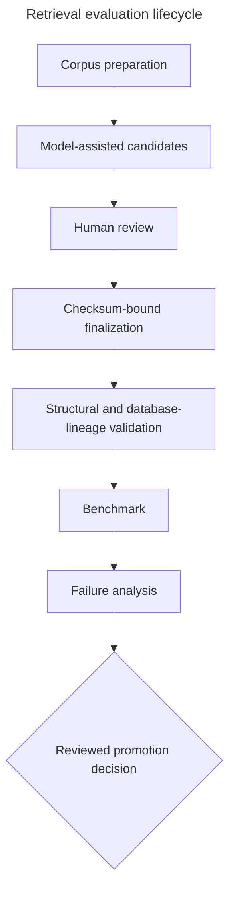

# Retrieval evaluation guide

Retrieval evaluation asks whether search returns the filing evidence needed to answer a question.
It is deliberately separate from answer evaluation: Hit Rate and MRR can diagnose search without
the extra variability of a generator, while a fluent answer cannot prove that retrieval worked.
Within the complete [setup, evaluation, and usage journey](getting-started.md), this workflow begins
after compatible corpora are ready and ends before full-RAG evaluation.

This workflow applies the ground-truth, search-evaluation, metrics, and tuning ideas from the
[Module 4 lessons](https://github.com/DataTalksClub/llm-zoomcamp/blob/main/04-evaluation/lessons/01-intro.md) and the [retrieval example in Module 7](https://github.com/DataTalksClub/llm-zoomcamp/blob/main/07-project-example/lessons/02-evaluating-retrieval.md) from [DataTalksClub LLM-Zoomcamp](https://github.com/DataTalksClub/llm-zoomcamp).

## From filing chunks to ground truth

The model proposes investor questions from sampled chunks, but those proposals are candidates—not
ground truth. A reviewer checks that the chunk is meaningful, the question is answerable from it,
the company/filing/Item labels are right, and the wording represents a useful information need.
Only accepted questions enter the checksum-bound dataset.

Stable `gtq-…` question IDs and SHA-256 chunk IDs let results survive reordering and make edits
visible. Each case has a relevance list because more than one chunk can legitimately satisfy a
question. The reviewed list is useful reference evidence, not a claim that every valid chunk in a
filing has been exhaustively annotated.

The dataset deliberately mixes two forms of coverage:

- `exact_keyword` questions retain distinctive filing language and exercise BM25.
- `semantic_paraphrase` questions express the same need differently and exercise meaning-based
  search.

Model-assisted creation improves breadth; human review supplies the trust boundary.

### Ground-truth question-generation prompt

`evaluation/prompts/investor-questions-v1.txt` participates only in dataset preparation. For each
sampled 10-K passage, it first classifies whether the passage is meaningful and self-contained. For
an accepted passage it proposes exactly three answerable investor questions: one that retains
distinctive filing terms and two semantic paraphrases. It also assigns one of the five research
goals. The prompt never answers a research question and is not used by the production research
service.

This constrained output gives every retained passage the same candidate shape and deliberately
exercises both lexical and semantic retrieval. It scales question drafting and discourages
questions about hidden metadata or the generation process. Its output can still reflect model bias,
copy source wording too closely, produce duplicates, misclassify a goal, or turn an incomplete
passage into an artificial question. It also cannot establish that a question resembles real user
demand.

For those reasons, the model output is a review aid rather than ground truth. A human checks passage
quality, answerability, natural wording, labels, duplication, and coverage before finalization. The
prompt version and SHA-256 checksum are stored with the generation run and review bundle: changing
the prompt changes the dataset-construction instrument, so candidates must be regenerated and
reviewed instead of silently mixed with an earlier bundle. The operational use of this prompt is in
[Generate the review bundle](../evaluation/REVIEW.md#4-generate-the-review-bundle).

## Metrics by hand

Hit Rate at `k` is the fraction of questions with at least one relevant result in the first `k`.
Reciprocal rank is `1 / r`, where `r` is the first relevant rank; a miss contributes zero. MRR is
the mean reciprocal rank.

Suppose three questions first hit at ranks 1, 4, and not at all. Their hits are `1, 1, 0`, so Hit
Rate is `2/3 = 0.667`. Their reciprocal ranks are `1, 0.25, 0`, so MRR is
`(1 + 0.25 + 0) / 3 = 0.417`. Hit Rate measures whether evidence appears; MRR rewards putting it
early. Always inspect misses and slices as well as averages.

## A controlled comparison

Every strategy must receive the same reviewed cases, corpus snapshots, company/accession/Item
filters, candidate depth, and `top_k`. Otherwise a score difference cannot be attributed to the
strategy. The grid compares:

| Strategy | What it measures |
| --- | --- |
| BM25 keyword | Exact terms and term rarity |
| Vector | Semantic similarity |
| Weighted hybrid | A normalized lexical/vector blend controlled by `alpha` |
| RRF | Rank fusion controlled by its rank constant |



Promotion is an operational decision, not an automatic side effect of evaluation.

The checked-in weighted-hybrid result (`candidate_count=10`, `top_k=10`, `alpha=0.25`) reached Hit
Rate `1.0` and MRR about `0.940`. That is strong evidence for these 96 cases and pinned corpora, not
universal proof: eleven questions did not rank relevant evidence first, coverage may omit future
needs, and corpus or query drift can change performance.

## Run the workflow

The authoritative setup, SQL, review gates, finalization, and troubleshooting live in
[Validate and run retrieval evaluation](../evaluation/REVIEW.md#7-validate-and-run-retrieval-evaluation).
The short path is:

```bash
# Validate reviewed files, checksums, configuration compatibility, and database lineage.
uv run sec-rag-evaluate-retrieval --dataset evaluation/retrieval-v1.jsonl --manifest evaluation/retrieval-v1-manifest.json --validate-only

# Run the controlled retrieval grid and write the benchmark artifacts.
uv run sec-rag-evaluate-retrieval --dataset evaluation/retrieval-v1.jsonl --manifest evaluation/retrieval-v1-manifest.json
```

For each miss or low rank, compare exact versus paraphrase performance, Item and company slices,
filters, candidate depth, and the retrieved text. Retune on the fixed benchmark, then validate on new
reviewed cases before treating an improvement as general.

## Promote an accepted result

Evaluation recommends a default but does not change runtime behavior. After reviewing coverage,
warnings, misses, latency, and the selection rationale in `evaluation/results/retrieval-v1.json`,
copy `selected_default.strategy`, `candidate_count`, `top_k`, `alpha`, and `rrf_k` into the `default`
object in `config/retrieval.json`. Update `reason` with the artifact identity, metrics, and human
decision. Keep the strict object complete even when a parameter is unused by the selected strategy.

Run the normal checks in [Testing](testing.md), restart FastAPI, and confirm startup accepts the
tracked configuration. Full-RAG evaluation must use this promoted default so every prompt receives
the same measured retrieval path.
