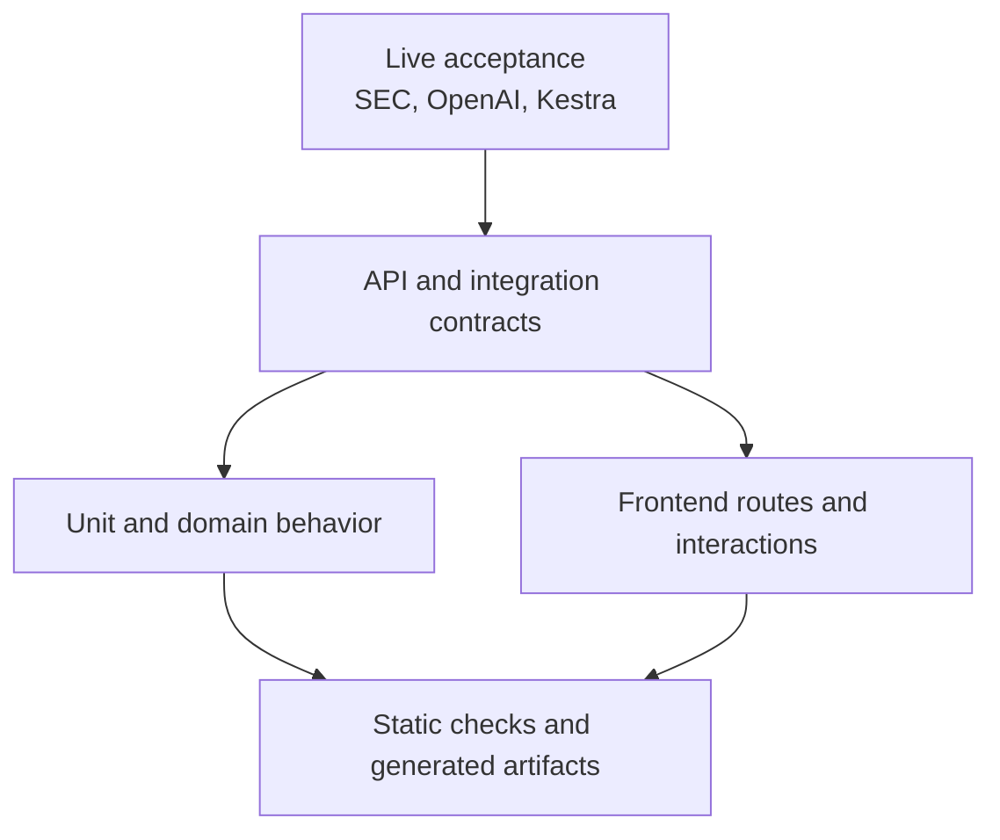

# Testing

Testing is divided by responsibility so deterministic application behavior can be verified without
routine provider calls. Passing tests establishes contract and processing integrity; retrieval or
generation quality also requires reviewed evaluation evidence.

## Test layers



| Layer | Location | Principal coverage |
| --- | --- | --- |
| Unit | `tests/unit` | extraction, chunks, retrieval, repositories, evaluation, startup, workflow policy |
| API | `tests/api` | route namespaces, validation, auth, lifecycle, response contracts |
| Live | `tests/live` | opt-in EdgarTools/SEC regression behavior |
| Frontend | `frontend/src/*.test.*` | routing, evaluation UI, corpus helpers, accessibility interactions |
| Artifact | generation CLI `--check` modes | OpenAPI and REST Client freshness |
| Static | Ruff, mypy, ESLint, Prettier, TypeScript | formatting, lint, and type contracts |

PostgreSQL repository tests use controlled database connections or fakes according to the module;
they must not depend on Kestra's database. Provider-facing behavior is isolated behind gateways.

## Normal verification

From the repository root:

```bash
# Check Python formatting, lint, and strict types.
uv run ruff format --check .
uv run ruff check .
uv run mypy

# Run provider-free backend tests with a disposable EdgarTools cache.
EDGAR_LOCAL_DATA_DIR=/tmp/edgar-cache uv run pytest

# Check frontend formatting, lint, tests, types, and production build.
npm --prefix frontend run check

# Verify generated public API artifacts are current.
uv run sec-rag-export-openapi --check
uv run sec-rag-generate-http --check

# Parse Dev Container shell hooks without executing them.
bash -n .devcontainer/post-create.sh .devcontainer/post-start.sh

# Validate the resolved local Compose configuration.
docker compose --env-file .env -f .devcontainer/docker-compose.yml config --quiet
```

`npm run check` runs Prettier verification, ESLint, Vitest, TypeScript compilation, and the Vite
production build. Provider-free pytest is the default; the live marker is opt-in.

## Live and cost-bearing checks

Run SEC acceptance explicitly:

```bash
# Run only the opt-in EdgarTools/SEC acceptance tests.
EDGAR_LOCAL_DATA_DIR=/tmp/edgar-cache uv run pytest -m live_edgar
```

Ground-truth generation, corpus embeddings, and generation evaluation call OpenAI and may incur
meaningful cost. They are operational/evaluation procedures, not ordinary tests. Before running,
confirm active models, pricing, rate limits, corpus size, expected case count, and whether an existing
compatible artifact can be resumed.

## RAG quality acceptance

Deterministic tests answer questions such as “are offsets correct?” and “does a malformed citation
fail?” They do not answer “does retrieval find useful evidence?” or “is the synthesis helpful?”

- Retrieval quality uses reviewed relevant chunks, Hit Rate, MRR, latency, coverage, and miss
  analysis. See [Evaluation](evaluation.md).
- Generation evaluation validates answer schemas, citation handles, policy outcomes, and judge
  results before prompt promotion.
- A valid artifact can still be unrepresentative; human coverage review remains an acceptance step.

## Documentation and migration integrity

Documentation tests resolve local Markdown links and enforce the current file structure. Migration
tests verify immutable checksums and required schema relations. If a migration checksum differs,
restore the applied file and create a new migration; never update recorded history to hide drift.

## Change-oriented checks

| Change | Minimum focused checks |
| --- | --- |
| Parser or sanitization | domain, SEC fixture, pipeline readiness, live regression when approved |
| Chunking or offsets | domain, retrieval, corpus-reader interval tests, benchmark rerun |
| Retrieval scoring/config | retrieval unit tests and complete reviewed benchmark |
| Generation prompt/policy | research tests and generation evaluation |
| Public route/schema | API tests plus generated-contract checks |
| Reader route/interaction | Vitest, TypeScript, production build, browser acceptance |
| Migration | migration tests, fresh apply, existing-schema upgrade path |
| Documentation structure | documentation link/structure tests |

Use Chromium as the exact EDGAR text-fragment acceptance target. Other browsers may legitimately
fall back to the filing top.
